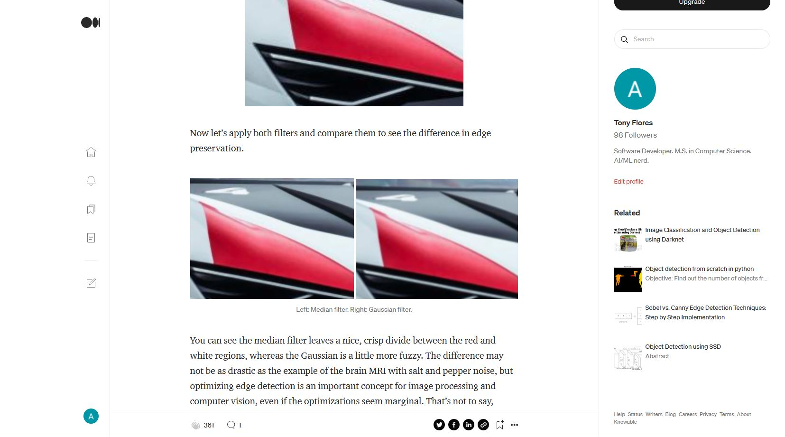

# Median Filtering

Computer vision is a fascinating subset of artificial intelligence. The fundamentals of computer vision start with the numerical representation of images and the elementary methods for manipulating them. Check out my brief discussion about median filtering using Python and OpenCV!

## [Median Filtering with Python and OpenCV](https://medium.com/@florestony5454/median-filtering-with-python-and-opencv-2bce390be0d1)

