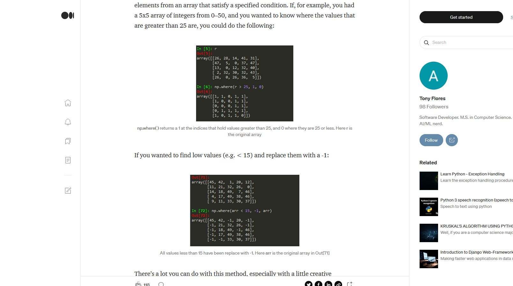

# Numerical Python with NumPy

Multi-dimensional arrays are fundamental building blocks for machine learning. When it comes to machine learning, NumPy is a great place to start if you already know the basics of Python. If you're interested in learning NumPy and working with multi-dimensional (n-dimensional) arrays, check out this post in Towards Data Science!

## [Intermediate Python: NumPy in Towards Data Science](https://towardsdatascience.com/intermediate-python-numpy-cec1c192b8e6)

