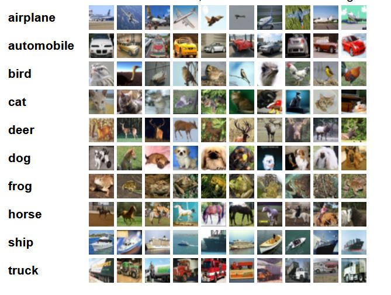

# Intro to the Intro

Based on the Torch library, PyTorch is one of the most popular deep learning frameworks for machine learning practitioners. Some of the things that make PyTorch popular are it's ease of use, dynamic computational graph, and the fact that it feels more "Pythonic" than other frameworks like Tensorflow.

For this tutorial, we will check out the base components of PyTorch, then walk through an image classification task, using the CIFAR10 dataset. Since PyTorch is loaded with tons of features, and there are tons of ways to apply them, this obviously won't be comprehensive. The purpose of this post is to serve as an introduction to the package and some of the components that you will use, as well as provide some resources so you can continue your journey. 

# The Tensor

The central component of PyTorch is the **tensor** data structure. If you're familiar with NumPy (if you're not, check out my NumPy article in [Towards Data Science](https://towardsdatascience.com/intermediate-python-numpy-cec1c192b8e6)), PyTorch tensors are similar to NumPy ndarrays, with the key difference being that they are CUDA-capable, and built to run on hardware accelerators, like GPUs. Another important feature that tensors possess is that they are optimized for [automatic differentiation](https://pytorch.org/tutorials/beginner/basics/autogradqs_tutorial.html), which is the basis of the neural network training algorithm known as **back propagation**. These two optimizations are crucial for deep learning:

* the vast amounts of data, features, and training iterations that deep learning usually encompasses requires the massively-parallel architecture of GPU's to train in reasonable amounts of time
* training through back propagation necessitates efficient and precise differentiation
 
> PyTorch also supports distributed computation, extending the training process beyond the bounds of a single machine!

With that said, let's take a look at the tensor API!


## Hands-on with tensors

> **Note**: If you want to follow along here, skip ahead to the Set-Up section first, so you can code along in Colab

We can create tensors naturally from **Python lists**: 

```python
A = [[6, 9, 2],
     [3, 3, 7],
     [1, 0, 3]]

A_tensor = torch.tensor(A)
```

This also works just as naturally with **Numpy ndArrays**:

```python
B = np.array([0,1,2,3])

B_tensor = torch.from_numpy(B)
```

Just like in NumPy (and Tensorflow, for that matter), we can initialize tensors with random values, all ones, or all zeroes. Just provide the `shape` (and `dtype` if you want to specify the data type):

```python
# with no dtype argument, torch will infer the type
C = torch.zeros(4,4) 
C

# tensor([[0., 0., 0., 0.],
#        [0., 0., 0., 0.],
#        [0., 0., 0., 0.],
#        [0., 0., 0., 0.]])
```

Let's not forget tensors don't have to be 2-dimensional!

```python
D = torch.ones(3,3,2, dtype=torch.int)
D

# tensor([[[1, 1],
#         [1, 1],
#         [1, 1]],
#
#        [[1, 1],
#         [1, 1],
#         [1, 1]],
#
#        [[1, 1],
#         [1, 1],
#         [1, 1]]], dtype=torch.int32)


```

A new tensor can be created from an existing one.  So, if we wanted, we could create a new Tensor of zeros with the same properties (shape and data type) as the `A_tensor` we created:

```python
A_tensor_zeros = torch.zeros_like(A_tensor)
A_tensor_zeros 

# tensor([[0, 0, 0],
#        [0, 0, 0],
#        [0, 0, 0]])

```

Or maybe you want random floating point values:

```python
# the dtype argument allows you to explicitly specify the datatype of the tensor
A_tensor_rand = torch.rand_like(A_tensor, dtype=torch.float) 
A_tensor_rand

# tensor([[0.2298, 0.9499, 0.5847],
#        [0.6357, 0.2765, 0.0125],
#        [0.1215, 0.1747, 0.9935]])

```

Want the attributes of a tensor?

```python
A_tensor_rand.dtype
# torch.float32
A_tensor_rand.shape
# torch.Size([3, 3])
A_tensor_rand.device
# device(type='cpu')
```

Creating tensors is fine, but the real fun starts when we can start manipulating them and applying mathematical operations. There are a **ton** of neat tensor operations already built-in, so we certainly won't have time to go through them all. Instead, I'll give you a [link to check them out in further detail](https://pytorch.org/docs/stable/torch.html), and just name a few:

* matrix multiplication
* compute eigenvectors and eigenvalues
* sorting
* index,slice,join
* hamming window (not sure what this is, but sounds cool!!)

# Dataset and Dataloader Modules

### Dataset

Like Tensorflow, PyTorch has a number of datasets included in the package (including [Text](https://pytorch.org/text/stable/datasets.html), [Image](https://pytorch.org/vision/stable/datasets.html),  and [Audio](https://pytorch.org/audio/stable/datasets.html) datasets). The deep learning part of this tutorial will use one of these built-in image datasets: `CIFAR10`. These datasets are very common, and widely documented around the ML community, so they are great for prototyping and benchmarking models, since you can compare the performance of your model to what others were able to achieve with theirs. 

```python
import torch
import torchvision
from torchvision.datasets import FashionMNIST # torchvision for image datasets
from torchtext.datasets import AmazonReviewFull # torchtext for text
from torchaudio.datasets import SPEECHCOMMANDS #torchaudio for audio

training_data = FashionMNIST(
    # the directory you want to store the dataset, can be a string e.g. "data"
    root = data_directory, 
    # if set to False, will give you the test set instead
    train = True, 
    # download the dataset if it's not already available in the root path you specified
    download = True, 
    # as the name implies, will transform images to tensor data structures so PyTorch can use them for training
    transform = torchvision.transforms.ToTensor() 
)
```

With this, if your dataset has labels or classifications, you can quickly view a list of those:

```python
training_data.classes

# ['T-shirt/top',
# 'Trouser',
# 'Pullover',
# 'Dress',
# 'Coat',
# 'Sandal',
# 'Shirt',
# 'Sneaker',
# 'Bag',
# 'Ankle boot']

training_data.class_to_idx # get the corresponding index with each class

# {'Ankle boot': 9,
# 'Bag': 8,
# 'Coat': 4,
# 'Dress': 3,
# 'Pullover': 2,
# 'Sandal': 5,
# 'Shirt': 6,
# 'Sneaker': 7,
# 'T-shirt/top': 0,
# 'Trouser': 1}
```

Now obviously built-in datasets will not be all you need as a machine learning practitioner. Although the process will be more complex than just importing a dataset, creating your own dataset with PyTorch is fairly easy and flexible. This is somewhat beyond the scope of this post, but I'll post an in-depth guide to creating datasets in the near-future. 

### DataLoader

Iterating through the dataset will go through each sample 1 by 1, so PyTorch gives us the DataLoader module to easily create minibatches in our datasets. `DataLoader` allows us to specify the `batch_size` as well as shuffle the data:

```python
train_dataloader = DataLoader(training_data, batch_size = 32, shuffle = True)
```

So in your deep learning workflow, you'll want to feed your data to your model for training through `DataLoader` in minibatches.

The deep learning portion of the tutorial will demonstrate working with the `DataLoader` and feeding it to a neural network.

One final important feature before we move on to Deep Learning is setting the device. When you want to train on a GPU you can check if a GPU is available for PyTorch to use:  

```python
torch.cuda.is_available()
# True if GPU available
```

PyTorch defaults to the CPU, so even with a GPU on hand, you still need to specify that you want to use the GPU for training. If you are certain your GPU is available, you can use .to("cuda") on your tensors and models. Otherwise, you might consider setting a device variable to whatever device is available:

```python
device = "cuda" if torch.cuda.is_available() else "cpu"

print(f"Device: {device}")
# 'cuda'

# you can specify .to("cuda") or .to(device)
tensor = tensor.to("cuda")
# attaching your neural network model to your GPU
model = model.to(device)
```

If you are using Google Colab, you will have access to a GPU for free (unless you want to subscribe). Speaking of Colab, let's move on to the setup for our classification task!

# Set-up

For this tutorial, we will be using Google Colab. Colab has been my go-to for all of my machine learning projects, because there is no easier setup, in my opinion. Obviously, some projects will require a different setup, but for smaller projects and tutorials, you can't really beat Colab's free GPU access and environment that already includes packages like PyTorch, NumPy, Scikit-Learn already installed.

So to start, navigate to the [Google Colab](https://colab.research.google.com) page, and sign in with your Google account. `File > New notebook`. Change the name of your notebook at the top to `pytorchIntro.ipynb` , or something else if you'd prefer. Colab doesn't give you an instance with GPU access by default, so you have to specify you want to use a GPU: at the top, go to `Runtime > Change runtime type > Hardware accelerator > Select "GPU" > Save`. Now you have a GPU to train your models! 

>If you're curious about the GPU that you'll be using, type `!nvidia-smi` and execute that line by hitting the Play button on the left of the line, or by pressing Shift+Enter. You can also run `!nvidia-smi -L` if all you want is the GPU device:

```
GPU 0: Tesla T4 (UUID: GPU-7619bc40-f58c-a507-3911-58907fbd2721)
```

Now that you have Colab up, and a GPU ready to train your model, let's get to the code.

# Imports

```py
import torch
from torch import nn
from torch.utils.data import DataLoader
from torchvision.utils import make_grid
from torchvision.datasets import CIFAR10
from torchvision.transforms import ToTensor
from torchvision.transforms import Normalize, Compose
import os
import matplotlib.pyplot as plt
import numpy as np
```
Add these imports to your first line, and execute that line. These are the main PyTorch modules we will be using, along with a few support imports. We will go over these in a little more detail when we use them.

# Dataset

### [CIFAR-10 dataset](https://www.cs.toronto.edu/~kriz/cifar.html)

This dataset consists of 60,000 32x32 color images, all labeled as one of 10 classes. The training set is 50,000 images, while the test set is 10,000. 

Here is a nice visualization of the dataset from the home source:

| |
|:--:| 
| *Source: https://www.cs.toronto.edu/~kriz/cifar.html* |

The goal for this project will be to build a model that can accurately classify images as one of the 10 classifications. 

# Loading the dataset 

So we imported CIFAR10 from torchvision, and now we need to download the actual dataset, and prepare it to be loaded into the neural network.

First, since we should normalize our images before feeding them to the model, we will define a `transform` function, and use `torchvision.transforms.Normalize` to [normalize](https://en.wikipedia.org/wiki/Normalization_(image_processing)) all of our images when we create the training and test data variables. The `Normalize` method takes the desired **mean** and **standard deviation** as agruments, and since these are color images, a value should be provided for each (R, G, B) color channel. 

We will set the values here to 0.5, since we would like to have the values of our image data to be close to 0, but there are other, more precise approaches to normalization. 

```py
transform = Compose(
    [ToTensor(),
     Normalize((0.5, 0.5, 0.5),  # mean
               (0.5, 0.5, 0.5))] # std. deviation
)
```

Now we can use our transform function in the transform argument so that PyTorch will apply this to the entire dataset.

```py
training_data = CIFAR10(root="cifar",
                        train = True, # train set, 50k images
                        download = True,
                        transform=transform)

test_data = CIFAR10(root = "cifar",
                    train = False, # test set, 10k images
                    download = True,
                    transform = transform)
```

Now that we have our dataset downloaded and normalized, we can prepare it to get fed to the neural network by using the PyTorch DataLoader, where we can define the `batch_size`.

```py
batch_size = 4

train_dataloader = DataLoader(training_data, 
                              batch_size=batch_size, 
                              shuffle=True)
test_dataloader = DataLoader(test_data, 
                             batch_size=batch_size, 
                             shuffle=True)
```

`DataLoader` is an iterable, so let's take a look at `train_dataloader` by checking out the dimensions of one iteration:

```py
for X, y in train_dataloader:
  print(f"Shape of X [N, C, H, W]: {X.shape}")
  print(f"Shape of y: {y.shape} {y.dtype}")
  break
# Shape of X [N, C, H, W]: torch.Size([4, 3, 32, 32])
# Shape of y: torch.Size([4]) torch.int64
```
Here X is the images, and y is the labels. We set `batch_size = 4` so each iteration through our `train_dataloader` is a mini-batch of 4 32x32 images and their 4 corresponding labels.

Now let's take a peak at some examples in our dataset.

```py
def imshow(img):
  img = img / 2 + .05 # revert normalization for viewing
  npimg = img.numpy()
  plt.imshow(np.transpose(npimg, (1,2,0)))
  plt.show()

classes = training_data.classes
training_data.classes
#['airplane',
# 'automobile',
# 'bird',
# 'cat',
# 'deer',
# 'dog',
# 'frog',
# 'horse',
# 'ship',
# 'truck']
```

```py
dataiter = iter(train_dataloader)
images, labels = dataiter.next()

imshow(make_grid(images))
print(' '.join(f'{classes[labels[j]]:5s}' for j in range(batch_size)))
```


Now we can see a few images and their corresponding labels. Normally you would want to conduct more thorough data exploration and analysis before moving on to model building, but since this is just an introduction to PyTorch we will move on to building and training the model.

# Defining the Base Model

Let's build a neural network.

First, we will define our model class, and name it `NeuralNetwork`. Our model will be a subclass of the PyTorch [nn.Module](https://pytorch.org/docs/stable/generated/torch.nn.Module.html), which is the base class for all neural network modules in PyTorch. 

Since we have color images in our dataset, the shape of each image is `(3, 32, 32)`, a 32x32 tensor in each of the 3 RGB color channels. Since our initial model will consist of fully-connected layers, we will need to [nn.Flatten()](https://pytorch.org/docs/stable/generated/torch.nn.Flatten.html) our input image data. Our flatten method will output a linear layer with 3072 (32 x 32 x 3) nodes. `nn.Linear()` takes the number of input neurons and the number of outputs as arguments, respectively (`nn.Linear(1024 in, 512 out)`). From here you can add `Linear` layers and `ReLU` layers to your heart's content! The output of our model is 10 logits corresponding to the 10 classes in our dataset. 

After we define the structure of the model, we will define the sequence of the forward pass. Since our model is a simple sequential model, our `forward` method will be really straightforward. The `forward` method will compute an output `Tensor` from input `Tensors`.

If you'd like to, you can simply print `model` once it's defined, so you can get a summary of the structure.

```py
class NeuralNetwork(nn.Module):
    def __init__(self):
        super(NeuralNetwork, self).__init__()
        self.flatten = nn.Flatten()
        self.linear_relu_stack = nn.Sequential(
            nn.Linear(32*32*3, 1024),
            nn.ReLU(),
            nn.Linear(1024, 512),
            nn.ReLU(),
            nn.Linear(512, 10)
        )

    def forward(self, x):
        x = self.flatten(x)
        logits = self.linear_relu_stack(x)
        return logits

model = NeuralNetwork().to(device)
print(model)
#NeuralNetwork(
#  (flatten): Flatten(start_dim=1, end_dim=-1)
#  (linear_relu_stack): Sequential(
#    (0): Linear(in_features=3072, out_features=1024, bias=True)
#    (1): ReLU()
#    (2): Linear(in_features=1024, out_features=512, bias=True)
#    (3): ReLU()
#    (4): Linear(in_features=512, out_features=10, bias=True)
#  )
#)
```

# Loss function and Optimizer

Since this is a classification problem, we will use the Cross-Entropy loss function. As a reminder, Cross-Entropy computes the log loss when the model outputs a predicted probability value betweeen 0 and 1. So as the predicted probability diverges from the true value, the loss increases rapidly (predictions that are wrong are penalized more if they are more confident). The graph below illustrates the behavior of the loss function as the predicted value gets closer and further from the true value.

|  |
|:--:|
| *Fig: the y-axis represents the loss, while the x-axis is the predicted value when the true value is 1.* |
| *As you can see, as the predicted value approaches 1, the loss approaches 0.* | 
| *The closer the predicted value to 0, the higher the value of the loss.* |

With PyTorch, we can just use `CrossEntropyLoss()`.  For other ML tasks, you can use different [loss functions](https://pytorch.org/docs/stable/nn.html#loss-functions) if they are more fitting. For our optimization algorithm, we will use stochastic gradient descent, which is implemented in the [torch.optim package](https://pytorch.org/docs/stable/optim.html), along with other optimizers like Adam and RMSprop. We just need to pass the parameters of our model, and the learning rate `lr`. If you want to use momentum or weight decay in your model optimization, you can pass that to the `SGD()` optimizer as well with the `momentum` and `weight_decay` parameters (both default to 0). 

```py
loss_fn = nn.CrossEntropyLoss()
optimizer = torch.optim.SGD( model.parameters(), lr=0.001 ) # momentum=0.9
```

# Defining the Training Loop

Here we define our `train()` function, where we will pass `train_dataloader`, `model`, `loss_fn`, and `optimizer` as arguments during the training process. The `size` variable is the length of the entire training dataset (50k). On the next line, `model.train()` is a PyTorch `nn.Module` method that sets the model to training mode, enabling certain behaviors that you would want during training (e.g. dropout, batch norm, etc.). In contrast (and as you'll see when we define our test function), you'd use `model.eval()` if you want to test your models performance. Next, we'll iterate through each mini-batch, specifying we'd like to utilize the GPU with `to(device)`. We feed the mini-batch to our model, compute the loss, then backpropagate. 

## Backpropagation and Training Progress Output

For the backprop step, we need to run `optimizer.zero_grad()` first. This sets gradient to zero before starting backprop, since we dont want to accumulate the gradient over subsequent passes (this behavior can be desired in some cases, like RNNs where you want gradient accumulation). `loss.backward()` uses the loss to compute the gradient, then we use `optimizer.step()` to update the weights. Finally, we can print out updates to the training process, outputting the computed loss after every 2000 training samples.

```py
def train(dataloader, model, loss_fn, optimizer):
    size = len(dataloader.dataset)
    model.train()
    for batch, (X, y) in enumerate(dataloader):
        X, y = X.to(device), y.to(device)

        # Compute prediction error
        pred = model(X)
        loss = loss_fn(pred, y)

        # Backpropagation
        optimizer.zero_grad()
        loss.backward()
        optimizer.step()

        if batch % 2000 == 0:
            loss, current = loss.item(), batch * len(X)
            print(f"loss: {loss:>7f}  [{current:>5d}/{size:>5d}]")
```

# Defining the Testing Method

Before training the model, let's implement the test function, so we can evaluate our model after every epoch, and output the accuracy on the test set. The big differences with the test method are that we use `model.eval()` to set the model into testing mode, and `torch.no_grad()` which will disable gradient calculation, since we don't use backpropagation during testing. Finally, we calculate the average loss for the test set and the overall accuracy.

```py
def test(dataloader, model, loss_fn):
    size = len(dataloader.dataset)
    num_batches = len(dataloader)
    model.eval()
    test_loss, correct = 0, 0
    with torch.no_grad():
        for X, y in dataloader:
            X, y = X.to(device), y.to(device)
            pred = model(X)
            test_loss += loss_fn(pred, y).item()
            correct += (pred.argmax(1) == y).type(torch.float).sum().item()
    test_loss /= num_batches
    correct /= size
    print(f"Test Error: \n Accuracy: {(100*correct):>0.1f}%, Avg loss: {test_loss:>8f} \n")
```


# Training our Model

Now that we have the dataset loaded and pre-processed, the neural network built out, and the loss function/optimizer/training loop defined... we're ready to train! Specify the number of `epochs` that you want to train the model for. Each epoch will go through a `train` loop, which outputs progress every 2000 samples, then it will `test` the model on the test set, and output the accuracy and loss on the test set after each epoch.

```py
epochs = 10
for t in range(epochs):
    print(f"Epoch {t+1}\n-------------------------------")
    train(train_dataloader, model, loss_fn, optimizer)
    test(test_dataloader, model, loss_fn)
print("Done!")
```

|  |
| :--: |
| *This is the what the output should look like for each training epoch* |


# Saving and Loading a Model

After training finishes, if you'd like to save your model to use for inference, use `torch.save()`. Pass `model.state_dict()` as the first argument; this is just a Python dictionary object which maps layers to their respective learned parameters (weights and biases). For the second argument, name your saved model (it's common convention to save PyTorch models using `.pth` or `.pt` extensions). You can also specify a full path for this argument if you prefer to save it in a specific location.

```py
torch.save(model.state_dict(), "cifar_fc.pth")
```

When you want to load your model for inference, use `torch.load()` to grab your saved model, and map the learned parameters with `load_state_dict`.

```py
model = NeuralNetwork()
model.load_state_dict(torch.load("cifar_fc.pth"))
```

# Evaluating the Model

You can iterate through the `test_dataloader` to check out a sample of images with their labels.

```py
dataiter = iter(test_dataloader)
images, labels = dataiter.next()

imshow(make_grid(images))
print('Ground Truth: ', ' '.join(f'{classes[labels[j]]:5s}' for j in range(4)))

```


Then compare it to our model's predicted labels to get a preview of it's performance:


```py
outputs = model(images)
_, predicted = torch.max(outputs, 1)

print('Predicted: ', ' '.join(f'{classes[predicted[j]]:5s}' for j in range(4)))
# Predicted:  dog   ship  automobile deer 
```

So we can see, our model seems like it's learning to classify! Let's see the numbers for our model's performance.

```py
 correct = 0
 total = 0

 with torch.no_grad():
   for data in test_dataloader:
     images, labels = data
     outputs = model(images)
     _, predicted = torch.max(outputs.data, 1)
     total += labels.size(0)
     correct += (predicted == labels).sum().item()

print(f'Model accuracy: {100 * correct // total} %')
# Model accuracy: 53 %
```
Accuracy of **53%** is not state-of-the-art, but it's much better than randomly guessing or just predicting one class, so our model has definitely learned some! :)

Next, we can quickly check out how it performed at classifying each class:


```py
correct_pred = {classname: 0 for classname in classes}
total_pred = {classname: 0  for classname in classes}

with torch.no_grad():
  for data in test_dataloader:
    images, labels = data
    outputs = model(images)
    _, predictions = torch.max(outputs, 1)

    for label,prediction in zip(labels, predictions):
      if label == prediction:
        correct_pred[classes[label]] += 1
      total_pred[classes[label]] += 1

for classname, correct_count in correct_pred.items():
  accuracy = 100 * float(correct_count) / total_pred[classname]
  print(f'Accuracy for class {classname:5s}: {accuracy:.1f}%')
# Accuracy for class airplane: 58.9%
# Accuracy for class automobile: 61.2%
# Accuracy for class bird : 33.5%
# Accuracy for class cat  : 35.4%
# Accuracy for class deer : 52.8%
# Accuracy for class dog  : 49.4%
# Accuracy for class frog : 60.6%
# Accuracy for class horse: 59.6%
# Accuracy for class ship : 64.5%
# Accuracy for class truck: 63.1%
```
So now we have a little better insight into our model's performance: images of cats and birds were more difficult for the network to classify. 

# To be continued...

Obviously, fully connected networks like the one we built in this tutorial aren't typically used for image classification. In part 2 of this tutorial, we will focus a little more on optimizing performance in PyTorch:
* using CNNs for image classification
* hyperparameter tuning
* data augmentation
* transfer learning

I hope you enjoyed, and learned a little. If you'd like to learn more, PyTorch has some excellent [documentation](https://pytorch.org/docs/stable/index.html), so I encourage you to check it out! Thanks for reading!

## [Published in Towards Data Science](https://medium.com/towards-data-science/intro-to-pytorch-part-1-663574fb9675)

|  |
|:--:| 
| *PyTorch is pretty awesome :)* |

