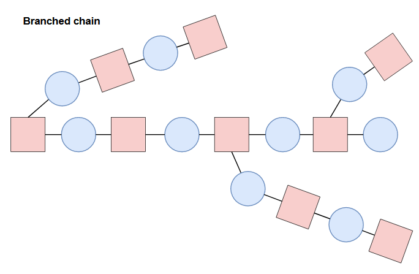
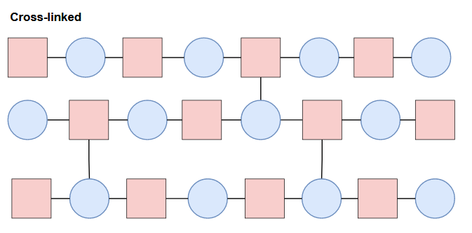
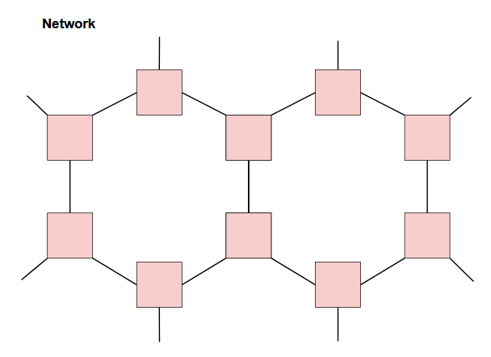
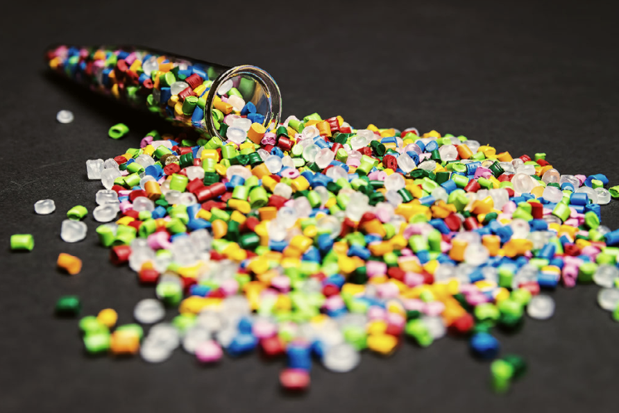
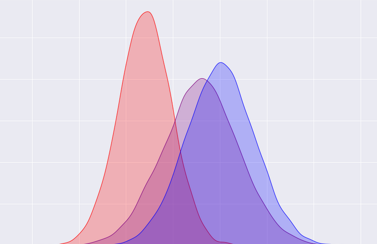

# Machine Learning in Materials Science

As the fields of artificial intelligence and machine learning are exploding, their *universal* nature is becoming more apparent. Machine learning is being leveraged in a huge variety of sub-fields, and Materials Science and Polymer Science are no exceptions. This article will serve as the first iteration of a series where I'll briefly discuss research papers related to Machine Learning and Materials Science, in which the goal is simply to explore the different ways that machine learning is being utilized in the field. 

In this iteration, we will focus on polymers. Since Polymer Science is a pretty niche field, I assume you are already familiar with the basics if you are reading this. However, if you are like me, and are just curious by nature, we will preface the paper review with some basics. I must give a disclaimer on my background: although I have worked in a lab where I routinely performed polymer characterization testing, I am in no way an expert-- just familiar with the space and some of the lab techniques used. Please keep this in mind as I **attempt** to touch on the science side of things. :)

---

### Basics of Polymers

Before getting into what polymers are on a molecular level, let's see some familiar materials that are good examples. Some examples of polymers include: plastic, nylon, rubber, wood, protein, and DNA. In this case, we will focus primarily on synthetic polymers like plastic and nylon.

At the molecular level, polymers are composed of long chains of repeating molecules. The molecule that repeats in this chain is known as a monomer (or subunit). Monomers are like the links in a chain. The image below illustrates multiple monomers being chained together to create a polymer, where the repeating sequence (denoted in brackets) can repeat n- times. 

There is a **huge** amount of potential molecules that can be used as monomers: the paper we will look at mentions that around 108 compounds are known, while it is believed that up to 1060 could exist! Let's check out some classic monomer examples.

Clearly, monomers come in all shapes and sizes! This is important, because the monomer is the basic building block of the material, so a different molecular structure can result in drastically different material properties. Molecular design (design and discovery of new molecules to use as monomers) is a key area of research in polymer science, and we will see some papers that focus on this (in this post, and in future iterations).

Polymer chains don't always have to consist of just one type of repeating unit. A **homopolymer** is a polymer where the repeating subunit is the same, whereas a **copolymer** will contain two types of subunits. There are even terpolymers (3) and tetrapolymers (4)! When polymers have more than one type of subunit, they don't necessarily have to alternate, as you can see in the illustration below.

Different compositions and configurations of subunits can yield different properties. On top of the primary structure (linear sequence of the chain), polymers can also contain branched chains, cross-links, or network structures.

Structural orientation and morphology on a higher order will affect properties as well. Further details are beyond the scope of this post, but the point to take home here is there is a lot of complexity to take into account, and on top of that, there are a seemingly infinite amount of possibilities in structure and composition (all which will change the properties and behavior of the material). With that said, it's clear that it would be essentially impossible to explore all the possibilities in the lab considering time, cost of materials and labor, etc. This is where computation and machine learning come in! 

In polymer informatics, machine learning can be applied to accelerated characterization of polymers, modeling and analysis, prediction of properties, and molecular design. Applying ML to the research workflow can lead to substantial savings in time and money, since most of the trial-and-error process is reduced by computation and prediction, greatly narrowing the search space for the actual work done in the lab. It sounds like an incredible solution to advancing research, but there are key challenges that must be taken into consideration: 

* limited data related to polymers
* normally requires a hybrid approach with expert input
* lab analysis required for validation

As more work is done in this space, the impact of these challenges should reduce significantly. With that said, the paper chosen for this review focuses on molecular design, and has a really interesting way of overcoming one of these key challenges. Let's check it out!

---

## Paper Review: Machine-learning-assisted discovery of polymers with high thermal conductivity using a molecular design algorithm

> Wu, S., Kondo, Y., Kakimoto, Ma. et al. [Machine-learning-assisted discovery of polymers with high thermal conductivity using a molecular design algorithm](https://rdcu.be/cNgzd). npj Comput Mater 5, 66 (2019). https://doi.org/10.1038/s41524-019-0203-2

Molecular design with machine learning is extremely promising, and there is a lot of work being done exploring this space. In this paper, the objective was to design new polymer material (focusing on the chemical structure of the repeating subunit) with a high [thermal conductivity](https://www.sciencedirect.com/topics/materials-science/thermal-conductivity), on-par with state-of-the-art [thermoplastics](https://en.wikipedia.org/wiki/Thermoplastic). 

What makes this paper interesting is the fact that the molecular structures proposed by the model were synthesized and *verified in the lab*. To quote the authors:

> "In the particular case of polymers, it is unprecedented that designed polymers were synthesized and experimentally confirmed."

Another fascinating aspect of this work is the use of domain knowledge to overcome a dataset with only 28 training instances with thermal conductivity data. The authors used alternate data, and instead targeted [glass transition temperature](https://www.sciencedirect.com/topics/chemistry/glass-transition-temperature) and melting point as "proxy properties", since they know polymers with higher glass transition and melting temperatures tend to also have higher thermal conductivity. 

### Bayesian Molecular Design using Probabilistic Language Models

Typically, when it comes to molecular design with machine learning, prediction runs in two directions. The "forward" direction is known as the **quantitative structure-property relationship**, or **QSPR**. Essentially in this direction, *physical and chemical properties are predicted* with a given chemical structure input. The backward direction is known as **inverse-QSPR**, and is exactly what it sounds like: given a set of target physical or chemical properties, a *molecular structure is predicted*. 

> Sidenote: Quantitative structure-activity relationship (QSAR) is similar to QSPR, but instead models the relationship between molecular structure and **biological activity**, instead of physical/chemical properties. This type of molecular design is essential for drug discovery. 

In this paper, the machine learning algorithm known as Bayesian molecular design was used. As stated before, the objective was to design the molecular structure of the monomer unit given a set of target physical properties (iQSPR). The chemical structures are represented using simplified molecular-input line-entry system (SMILES) notation, which essentially compresses the chemical structure into a string:

|  |
|:--:|
| *Visualization of the SMILES algorithm. Image Source: [Wikipedia](https://en.wikipedia.org/wiki/Simplified_molecular-input_line-entry_system)* |

The forward model is defined as `p(Y∈U|S)`, and the backward model defined as `p(S|Y∈U)`: 
> the probability of a chemical structure **S** given that it's physical property **Y** lies in the region **U**, where **Y** is thermal conductivity and **U** is the desired range of values. 
 
### Prior Distribution
A prior distribution **p(S)** was used to minimize the occurrence of invalid chemical structures predicted by the model. To define **p(S)**, an [n-gram model](https://web.stanford.edu/~jurafsky/slp3/3.pdf) of order `n = 10` was trained on 14,423 homopolymers in the [**PolyInfo**](https://polymer.nims.go.jp/en/) database to learn realistic and favorable structural molecular patterns. 

### Forward Prediction Step
1000 neural nets were trained using the forward prediction model, aiming to predict **glass transition temp.** and **melting temp.** with the monomer chemical structure as input. From here, the model that performed the best at predicting the original target of **thermal conductivity** was used, and fine-tuned on the small amount of *thermal conductivity* data using transfer learning and [**MXNet**](https://github.com/apache/incubator-mxnet).

### Backward Prediction Step and Validation
Finally, with the prior distribution and the forward model, the backward model was formed and used to generate 1000 chemical structures using a sequential Monte Carlo method. From these structures, 3 were selected based off of their theoretical synthesizability and ease of processing using an [SA Score](https://www.researchgate.net/publication/42344111_Estimation_of_Synthetic_Accessibility_Score_of_Drug-Like_Molecules_Based_on_Molecular_Complexity_and_Fragment_Contributions). 

The 3 selected polymers (referred to as 4, 13, and 19) were synthesized, and their thermophysical properties were tested in the lab. The thermal conductivity absolute prediction errors for 4, 13, and 19 were 0.015, 0.001, and 0.017 W/mK, respectively, indicating a high level of agreement between predicted and experimental values. In the end, the values ranged from **0.18-0.41 W/mK**, which are comparable to state-of-the-art thermoplastics, and aligned with the range the researchers were targeting. 

These results are really exciting to see, especially considering that openly available data in this space is still lacking. If the scientific community can contribute and significantly expand available polymer data, I think some really promising research can be done utilizing machine learning. If you are curious about the details of the methods used in this paper, [I encourage you to give it a read](https://www.nature.com/articles/s41524-019-0203-2.epdf?sharing_token=E-iwfNr-YoElwGuzhmRbBtRgN0jAjWel9jnR3ZoTv0MHuyid8yZr0Vl4erv1AGAsyqMODXQ5YqlX4Z5s71TTgogZgQlqZgpFdZrBqNU0nPODTOhlTzOsLYIIZFpB_jKQCoUgtTuuZM4fYqpUlTCDMvlrzATIFGGMjVg4CtDfgGY%3D)! 

# Conclusion
It's really fascinating to see machine learning applied to different domains, and I think some really cool and important results can be achieved in the materials science and engineering space, especially digging into optimizing for sustainability and improving environmental friendliness. :) 
I hope to continue this series for a long time, and welcome any criticism or suggestions for improvement! Thanks for reading!

# References

* <https://link.springer.com/article/10.1007/s10822-016-0008-z>
* <https://www.ncbi.nlm.nih.gov/pmc/articles/PMC7050509/>
* <https://onlinelibrary.wiley.com/doi/10.1002/inf2.12167>