# Intro
In the previous iteration of this series, we worked with the CIFAR-10 dataset and introduced the basics of PyTorch: 

* The Tensor and some associated operations
* Datasets and the DataLoader
* Building a basic neural network
* Basic model training and evaluation

The model we developed for classifying images in the CIFAR-10 dataset was only able to achieve a 53% accuracy on the validation set, and really struggled to correctly classify images of some classes, like birds and cats (~33-35%). This was expected, since we would normally use Convolutional Neural Networks for image classification. In this part of the tutorial series, we will focus on CNN's and improving the performance of image classification on CIFAR-10.

# CNN Basics

Before we dive into the code, let's discuss the basics of convolutional neural networks so we can have a better understanding of what our code is doing. If you're comfortable with how CNN's work, feel free to skip this section. 

In comparison to feed-forward networks, like the one we developed in the previous part of the series, CNN's have different architecture, and are composed of different types of layers. In the figure below, we can see the general architecture of a typical CNN, including the different types of layers it can contain. 

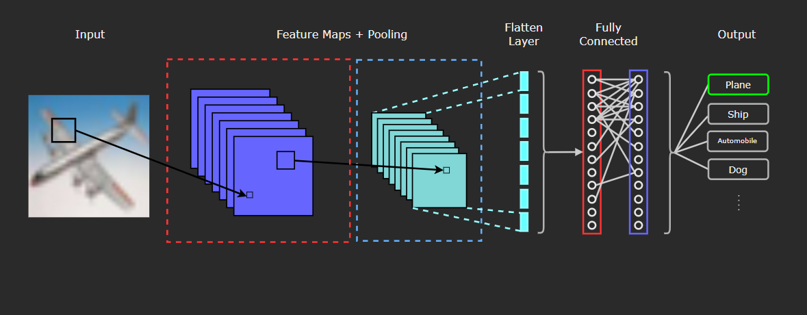

The three types of layers usually present in a Convolutional Network are:

* Convolutional Layers (red dashed outline)
* Pooling Layers (blue dashed outline)
* Fully Connected Layers (Red and Purple solid outlines)

## Convolutional Layer 

The defining component, and first layer of a CNN is the convolutional layer, and it consists of the following:

* Input data (in this case, in image)
* Filters
* Feature Maps 

What really differentiates a convolutional layer from a densely connected layer is the convolution operation. We wont get into the deep specifics on the definition of convolution, but if you are really interested and want to get into the meat of it, [this article](https://betterexplained.com/articles/intuitive-convolution/#Part_3_Mathematical_Properties_of_Convolution) does an excellent job of explaining the mathematical definition, as well as giving some really fine concrete examples. I highly recommend it if you're interested!

So why is convolution better than a densely/fully connected layer for image data? In essence, dense layers will learn global patterns in their inputs, while convolutional layers have the advantage of learning local and spatial patterns. That may sound kind of vague or abstract, so let's check out an example of what this means.

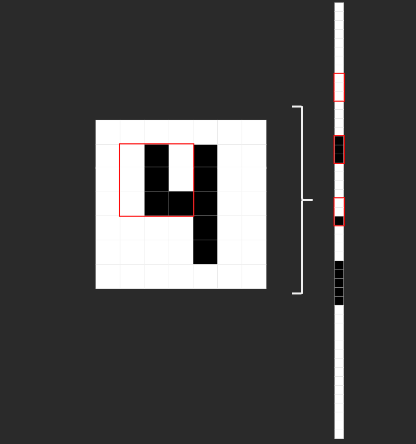

On the left of the image we can see how a basic 2-D, black and white image of a 4 would be represented in a convolutional layer. The red square would be the filter/feature detector/kernel, convolving over the image. On the right is how the same image would be input into in a densely connected layer. You can see the same 9 image pixels that were framed by the kernel in red. Notice how on the left, pixels are grouped spatially, adjacent to other neighboring pixels. On the right, however, those same 9 pixels are no longer neighbors. 

With this, we can see how the spatial/location-based information is lost when an image is flattened and represented in a fully-connected/linear layer. This is why convolutional neural networks are more powerful at working with image data. The spatial structure of the input data is maintained, and patterns (edges, textures, shapes, etc.) in the image can be learned. 

This is essentially the **why** for using CNN's on images, but now let's discuss the **how**. Let's have a look at the structure of our input data, these things we keep talking about called 'filters', and what convolution looks like when we put it all together.

### Input Data

The CIFAR-10 dataset contains 60,000 32x32 color images, and each image is represented as a 3-D tensor. Each image will be a `(32,32,3)` tensor, where the dimensions are 32 (height) x 32 (weight) x 3 (R-G-B color channels). The figure below illustrates the 3 different color channels (RGB) separated out from the fully color image of a plane in the dataset.

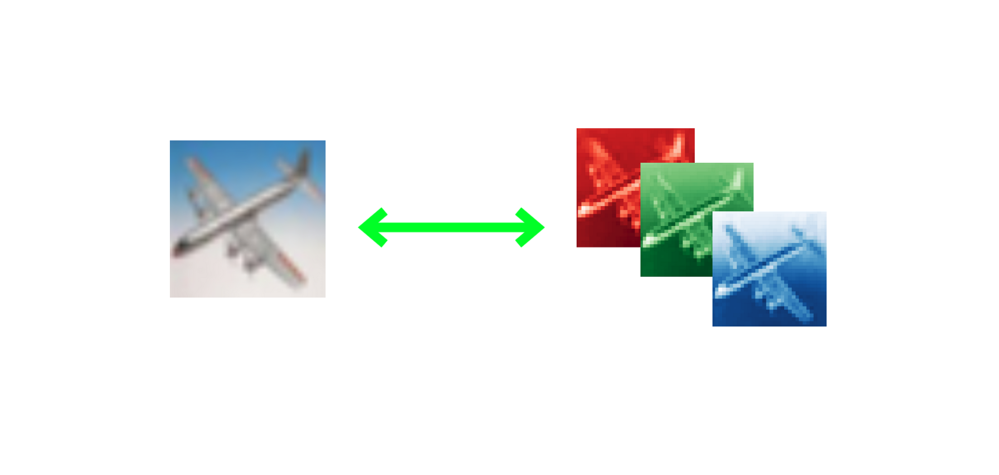

Images are usually thought of as 2-dimensional, so it can be easy to foget that since they have 3 color channels, they will actually be represented in 3 dimensions! 

### Filters

The filter (also referred to as a kernel or feature detector) in a convolutional layer is an array of weights that essentially scans over the image in a sliding-window fashion, computing the dot product at each stop, and outputs this dot product into a new array called a feature map. The sliding-window scanning is called convolution. Let's have a look at an illustration of this process to help make sense of what's going on.

| 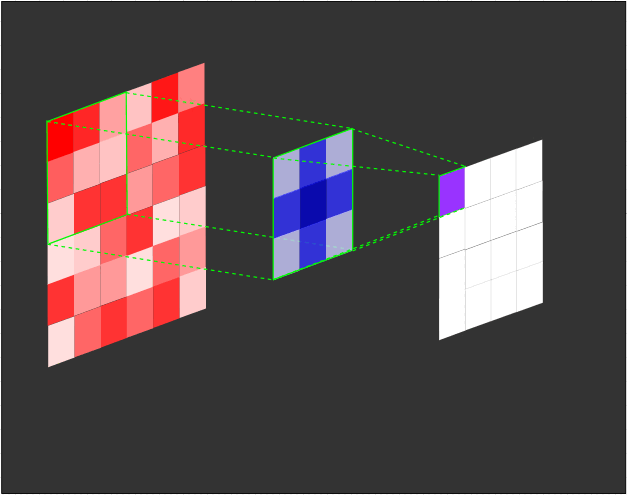 |
|:--:|
| *Illustration of a 3x3 filter (blue) convolving over an input (red) to create a feature map (purple).* |

| 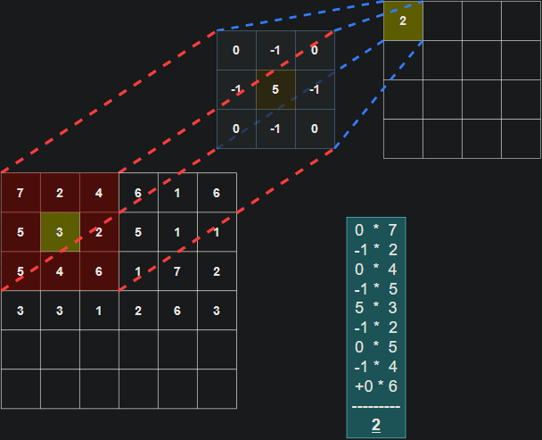 |
|:--:|
| *Illustration of the dot product computation at every step of the convolution.* |

It's important to note that the weights of the filter remain the same through each step. Just like the weights in a fully connected layer, these values are learned during training, and adjusted after each training iteration through backpropagation. The illustrations don't tell the whole picture though. When training a CNN, your model won't just have 1 filter at a convolutional layer. It's pretty common to have 32 or 64 filters in a single convolutional layer, and in fact, we will have up to 96 filters in a layer in the model we develop in this tutorial. 

Finally, though the weights of the filters are the main parameters that are trained, there are also hyper-parameters that can be tuned for CNNs: 
* number of filters in a layer
* dimensions of filters
* stride (number of pixels a filter moves each step)
* padding (how the filter handles boundaries of images)

We won't get into the details of these hyperparameters, since this isn't intended to be a comprehensive CNN walkthrough, but these are important factors to be aware of.

# Pooling Layer

Pooling layers are similar to convolutional layers, in that a filter convolves over the input data (usually a feature map that was ouput from a convolutional layer). However, rather than feature detection, the function of pooling layers is dimensionality reduction or downsampling. The two most common types of pooling used are Max Pooling and Average Pooling. With Max Pooling, the filter slides across the input, and at each step will select the pixel with the largest value as the output. In Average Pooling, the filter will output the average value of the pixels that the filter is passing over.

# Fully Connected Layer

Finally, CNNs typically will have fully connected layers after convolutional and pooling layers, and these layers will perform the classification in image classification tasks such as the one in this tutorial. 

Now that we've gotten to see how Convolutional Neural Nets are structured and how they operate, let's get to the fun part and train our own CNN in PyTorch! 

# Setup

As with the first part of this tutorial, I recommend using Google Colab to follow along since you will have your Python environment set up already with PyTorch and other libraries installed, as well as a GPU to train your model.

So, if you are using Colab, to make sure you are utilizing a GPU go to `Runtime` and click `Change runtime type`. 

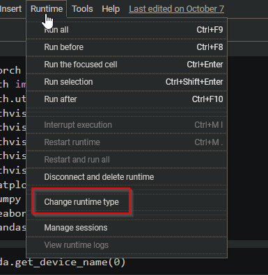

In the dialog select `GPU` and save.

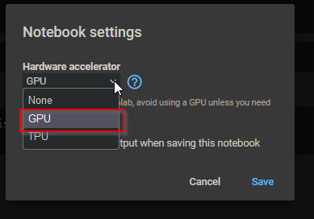

Now you have GPU access in Colab, and we can verify your device with PyTorch. So first, let's get our imports taken care of:

```py
import torch
from torch import nn
from torch.utils.data import DataLoader
from torchvision.utils import make_grid
from torchvision.datasets import CIFAR10
from torchvision import transforms
from torchvision import utils
from torchvision.utils import make_grid
import matplotlib.pyplot as plt
import numpy as np
import seaborn as sns
import pandas as pd
```

If you want to check what GPU you have access to, type and execute `torch.cuda.get_device_name(0)` and you should see your device output. Colab has a few different GPU options available, so your output will vary depending on what you are given access to, but as long as you dont get `RuntimeError: No CUDA GPUs are available` when you run this code, you are using a GPU!

We can set our GPU as `device` so as we develop our model, we can assign it to the GPU by referencing `device`, as well as use CPU if we don't have a CUDA GPU device available.

```py
device = "cuda" if torch.cuda.is_available() else "cpu"
print(device)
# cuda
```

Next, let's set a random seed so that our results are reproducible as well as download our training data and set a `transform` to convert images to Tensors and Normalize the data.

```py
torch.manual_seed(42)
```

```py
transform = transforms.Compose(
    [transforms.ToTensor(),
     transforms.Normalize((0.5, 0.5, 0.5), (0.5, 0.5, 0.5))]
)
```

```py
training_data = CIFAR10(root="cifar",
                        train = True,
                        download = True,
                        transform=transform)

test_data = CIFAR10(root = "cifar",
                    train = False,
                    download = True,
                    transform = transform)
```

Once that has finished downloading, let's check out the classes in the dataset:

```py
classes = training_data.classes
classes
#['airplane',
# 'automobile',
# 'bird',
# 'cat',
# 'deer',
# 'dog',
# 'frog',
# 'horse',
# 'ship',
# 'truck']
```

Finally, let's setup our train and test dataloaders:

```py
batch_size = 24

train_dataloader = DataLoader(training_data, batch_size=batch_size, shuffle=True, num_workers=0)
test_dataloader = DataLoader(test_data, batch_size=batch_size, shuffle=True, num_workers=0)

for X, y in train_dataloader:
  print(f"Shape of X [N, C, H, W]: {X.shape}")
  print(f"Shape of y: {y.shape} {y.dtype}")
  break

#Shape of X [N, C, H, W]: torch.Size([24, 3, 32, 32])
#Shape of y: torch.Size([24]) torch.int64
```

Now we're ready to build our model!

# Building the CNN

In PyTorch,  `nn.Conv2d` is the convolutional layer that is used on image input data. The first argument for `Conv2d` is the number of channels in the input, so for our first convolutional layer, we will use 3 since a color image will have 3 color channels. After the first convolutional layer, this argument will depend on the number of channels output from the previous layer. The second argument  is the number of channels that are output from the convolution operation in the layer. These channels are the feature maps that were discussed in the intro to the convolutional layer. Finally, the third argument will be the size of the kernel or filter. This can be an integer value like `3` for a `3x3` kernel, or a tuple such as `(3,3)`. So our convolutional layers will take the form of `nn.Conv2d(in_channels, out_channels, kernel_size)`. Additional optional parameters can be added, including (but not limited to): `stride`, `padding`, and `dilation`. We will use `stride=2` in our convolutional layer `conv4`. 

After our series of convolutional layers, we will want to use a flattening layer to flatten our feature maps to be able to feed into linear layers, and for that we will use `nn.Flatten()`. We can apply batch normalization with `nn.BatchNorm1d()` and will need to pass the number of features as an argument. Finally, our linear, fully-connected layers are built using `nn.Linear()`, which will also take the number of features as the first argument, as well as specifying the number of output features as the second argument.

So to begin defining the base architecture of our model, we will define a `ConvNet` class that inherits from the PyTorch `nn.Module` class. We can then define each of our layers as attributes for our class, and build them as we see fit. Once we've specified the layer architecture, we can define the flow of the model by creating a `forward()` method. We can wrap each layer with an activation function, and in our case we will be using `relu`. We can apply `dropout` between layers by passing the previous layer and `p` the probability of an element being dropped out (which defaults to 0.5). Finally, we create our model object and attach it to our `device` so that it can train on the GPU.


```py
class ConvNet(nn.Module):
  def __init__(self):
    super().__init__()
    self.d1 = 0.1
    self.conv1 = nn.Conv2d(3, 48, 3)
    self.conv2 = nn.Conv2d(48, 48, 3)
    self.conv3 = nn.Conv2d(48, 96, 3)
    self.conv4 = nn.Conv2d(96, 96, 3, stride=2)
    self.flat = nn.Flatten()
    self.batch_norm = nn.BatchNorm1d(96 * 12 * 12)
    self.fc1 = nn.Linear(96 * 12 * 12, 256)
    self.fc2 = nn.Linear(256, 10)

  def forward(self, x):
    x = nn.functional.relu(self.conv1(x))
    x = nn.functional.relu(self.conv2(x))
    x = nn.functional.dropout(x, self.d1)
    x = nn.functional.relu(self.conv3(x))
    x = nn.functional.relu(self.conv4(x))
    x = nn.functional.dropout(x, 0.5)
    x = self.flat(x)
    x = nn.functional.relu(self.batch_norm(x))
    x = nn.functional.relu(self.fc1(x))
    x = self.fc2(x)
    return x

model = ConvNet().to(device)
```

# Train and Test Functions

If you went through the first part of this tutorial, our train and test functions will be identical to what we created then, except that we will be returning the `loss` in our train method, and `loss` and number of `correct` in our test method to utilize when we are tuning hyperparameters. 

```py
# Train Method
def train(dataloader, model, loss_fn, optimizer, verbose=True):
    size = len(dataloader.dataset)
    model.train()
    for batch, (X, y) in enumerate(dataloader):
        X, y = X.to(device), y.to(device)

        # Compute prediction error
        pred = model(X)
        loss = loss_fn(pred, y)

        # Backpropagation
        optimizer.zero_grad()
        loss.backward()
        optimizer.step()
        if verbose == True:
          if batch % 50 == 0:
              loss, current = loss.item(), batch * len(X)
              print(f"loss: {loss:>7f}  [{current:>5d}/{size:>5d}]")
    return loss
```

```py
# Test Method
def test(dataloader, model, loss_fn, verbose=True):
    size = len(dataloader.dataset)
    num_batches = len(dataloader)
    model.eval()
    test_loss, correct = 0, 0
    with torch.no_grad():
        for X, y in dataloader:
            X, y = X.to(device), y.to(device)
            pred = model(X)
            test_loss += loss_fn(pred, y).item()
            correct += (pred.argmax(1) == y).type(torch.float).sum().item()
    test_loss /= num_batches
    correct /= size
    if verbose == True:
        print(f"Test Error: \n Accuracy: {(100*correct):>0.1f}%, Avg loss: {test_loss:>8f} \n")
    return test_loss, correct # For reporting tuning results/ early stopping
```

Finally, we define the loss function and optimizer before the base model training.

```py
loss_fn = nn.CrossEntropyLoss()
optimizer = torch.optim.Adam(model.parameters(), lr=0.001)
```

Let's train the model.

```py
epochs = 10
for t in range(epochs):
    print(f"Epoch {t+1}\n-------------------------------")
    train(train_dataloader, model, loss_fn, optimizer)
    test(test_dataloader, model, loss_fn)
print("Done!")
```

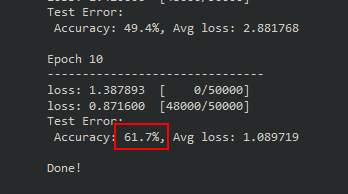

After only 10 epochs, 61.7% is much better performance than fully connected model we trained! It's pretty clear that a CNN is much better suited for classifying images, but we can squeeze out even more performance by extending the training duration and tuning hyperparameters. Before we get to that, let's take a quick peek under the hood and check out what the filters look like. Recall that the pixels of the filters are the trainable parameters in our model. This isn't a necessary step for training a model for image classification, nor will we find much useful information, but it's pretty neat to see what's going on inside our model. 

# Visualizing Filters

We can write a function to plot the filters from a specified layer in the model. All we have to do is specify which layer we want to see and pass that into our function.

```py
def visualizeTensor(tensor, ch=0, all_kernels=False, nrow=8, padding=1): 
    n,c,w,h = tensor.shape

    if all_kernels: 
        tensor = tensor.view(n*c, -1, w, h)
    elif c != 3: 
        tensor = tensor[:,ch,:,:].unsqueeze(dim=1)

    rows = np.min((tensor.shape[0] // nrow + 1, 64))    
    grid = utils.make_grid(tensor, 
                           nrow=nrow, 
                           normalize=True, 
                           padding=padding)
    grid = grid.cpu() # back to cpu for numpy and plotting
    plt.figure( figsize=(nrow,rows) )
    plt.imshow(grid.numpy().transpose((1, 2, 0)))
```

Let's check out what the filters in the first convolutional layer (`conv1`) look like since these are applied directly to the images.

```py
filter = model.conv1.weight.data.clone()
visualizeTensor(filter)
plt.axis('off')
plt.ioff()
plt.show
```

Below is the output, containing the visualization of the 48 filters from our `conv1` convolutional layer. We can see that each filter is a 3x3 tensor of different values or colors.

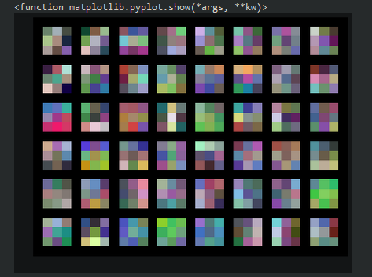

If our filters were 5x5 instead, we would see this difference in the plot. Recall that with `nn.Conv2d` we can change the size of the filter with the third argument, so if we wanted a 5x5, `conv1` would look like this:

```py
self.conv1 = nn.Conv2d(3, 48, 5) # New Kernel Size
```

If we re-trained the model with the new 5x5 filters the output would now look like this:

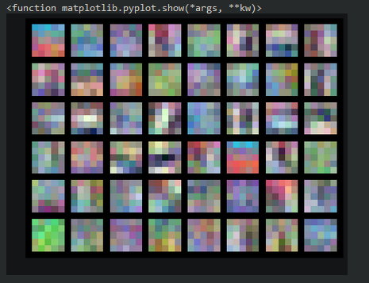

Like I mentioned before, not too much useful information, but interesting to see nonetheless. 

# Hyperparameter Optimization

For this tutorial, the hyperparameters that we'll be tuning are the number of filters in our convolutional layers, and the number of neurons in our linear layer. Right now these values are hard-coded into our model, so to make them tunable we will need to make our model configurable. We can use parameters (`c1`, `c2`, and `l1`) in our models `__init__` method, and create the model's layers with these values, which will be passed dynamically during the tuning process. 

```py
class ConfigNet(nn.Module):
  def __init__(self, l1=256, c1=48, c2=96, d1=0.1):
    super().__init__()
    self.d1 = d1
    self.conv1 = nn.Conv2d(3, c1, 3)
    self.conv2 = nn.Conv2d(c1, c1, 3)
    self.conv3 = nn.Conv2d(c1, c2, 3)
    self.conv4 = nn.Conv2d(c2, c2, 3, stride=2)
    self.flat = nn.Flatten()
    self.batch_norm = nn.BatchNorm1d(c2 * 144)
    self.fc1 = nn.Linear(c2 * 144, l1)
    self.fc2 = nn.Linear(l1, 10)

  def forward(self, x):
    x = nn.functional.relu(self.conv1(x))
    x = nn.functional.relu(self.conv2(x))
    x = nn.functional.dropout(x, self.d1)
    x = nn.functional.relu(self.conv3(x))
    x = nn.functional.relu(self.conv4(x))
    x = nn.functional.dropout(x, 0.5)
    x = self.flat(x)
    x = nn.functional.relu(self.batch_norm(x))
    x = nn.functional.relu(self.fc1(x))
    x = self.fc2(x)
    return x

model = ConfigNet().to(device)
```

We certainly aren't limited to tuning only these hyperparameters. In fact, learning rate and batch size are commonly included in the list of hyperparameters to tune, but since we will be using a grid search, we'll have to greatly reduce the number of tunable variables to keep the training time reasonable.

Next let's define a dictionary for our search space, as well as one to save the parameters that give us the best results. Since we're using grid search for our optimization, every combination of each hyperparameter listed will be used. You can just as easily add more values to the lists for each hyperparameter, but each additional value will greatly increase the runtime, so it's recommended to start with the following values to save time.

```py
search_space = {
    'c1': [48, 96],
    'c2': [96, 192],
    'l1': [256, 512],
}

best_results = {
    'c1': None,
    'c2': None,
    'l1': None,
    'loss': None,
    'acc': 0
}
```

### Early Stopping

One component that will be important in our optimization process is the usage of early stopping. Since we'll have multiple training runs, each taking a significant amount of time to complete, we will want to cut a run short if training performance doesn't show improvement. There's no sense it continuing to train a model that isn't improving. 

In essence, we will keep track of the lowest loss the model has produced after each epoch. We then define a `tolerance`, which specifies the number of epochs the model has to attain a better loss. If it doesn't achieve a lower loss within the specified tolerance, training is terminated for that run, and we move on to the next combination of hyperparamters. If you're like me, and you like to check in on the training process, we can log updates to the console and see when the early stopping counter increases by setting `self.verbose = True`. You can hard code that into the `EarlyStopping` class here, or you can change the `verbose` value when we instantiate an `EarlyStopping` object during our optimization process.

```py 
class EarlyStopping():
    def __init__(self, tolerance=5, verbose=False, path="cifar-tune.pth"):
      self.tolerance = tolerance
      self.counter = 0
      self.early_stop = False
      self.lowest_loss = None
      self.verbose = verbose
      self.path = path

    def step(self, val_loss):
      if (self.lowest_loss == None):
        self.lowest_loss = val_loss
        torch.save(model.state_dict(), self.path)
      elif (val_loss < self.lowest_loss):
        self.lowest_loss = val_loss
        self.counter = 0
        torch.save(model.state_dict(), self.path)
      else:
        if self.verbose:
          print("Early stop counter: {}".format(self.counter+1))
        self.counter +=1
        if self.counter >= self.tolerance:
          self.early_stop = True
          if self.verbose:
            print('Early stopping executed.')
```


# Image Augmentation

We have one last thing to do before setting up our hyperparameter optimization method to squeeze out some extra performance, and curb overfitting on our training data. Image Augmentation is a technique which applies random transforms to images, essentially creating "new" artificial data. These transforms can be things like:
* rotating an image a few degrees
* flipping an image horizontally/vertically
* cropping
* slight brightness/hue shifts
* random zooming

Including these random transforms will improve the model's ability to generalize, since augmented images will be similar, but distinct to the original image. The contents and patterns will remain, but the array representation will be different.

PyTorch makes image augmentation easy with the `torchvision.transforms` module. If we have several transforms we would like to apply, we can chain them together with `Compose`. One thing to keep in mind is that image augmentation requires a little bit of computation **per transform**, and this is applied to **every image** in the dataset. Applying a lot of different random transforms to our dataset will increase the time it takes to train. So for now, let's limit the transforms so our training doesn't take too long. If you would like to add a few more, check out [the PyTorch docs on transforming and augmenting images](https://pytorch.org/vision/stable/transforms.html), and just add those into the `Compose` list.

Once we have the augmentation transforms picked, we can apply them to the dataset just as we would apply Normalization and transforming the images to a tensor.

```py
# Augment Images for the train set
augmented = transforms.Compose([
    transforms.RandomRotation(20),
    transforms.ColorJitter(brightness=0.2, hue=0.1),
    transforms.RandomHorizontalFlip(p=0.5),
    transforms.ToTensor(),
    transforms.Normalize((0.5, 0.5, 0.5), (0.5, 0.5, 0.5))
])

# Standard transformation for validation set
transform = transforms.Compose([
    transforms.ToTensor(),
    transforms.Normalize((0.5, 0.5, 0.5), (0.5, 0.5, 0.5))
])

training_data = CIFAR10(root="cifar",
                        train = True,
                        download = True,
                        transform=augmented)

test_data = CIFAR10(root = "cifar",
                    train = False,
                    download = True,
                    transform = transform)
```                    

Now that we have image augmentation set up on our training data, we're ready to set up our hyperparameter optimization method.

# Defining the Optimization Method

We can create a class (`HyperSearch`) with attributes for the hyperparameter value configuration, verbose reporting setting, a report list so we can see how each configuration performed after optimization completes, and a variable to store the config with the best performance.

```py
class HyperSearch():
    def __init__(self, config, verbose=True):
      self.config = config
      self.verbose = verbose
      self.report_list = []
      self.best_results = { 'c1': None,
                            'c2': None,
                            'l1': None,
                            'loss': None,
                            'acc': 0
                          }
```

Next, we can create a method (still in our `HyperSearch` class) to perform the grid search and do a training run with each combination of hyperparameters. First we'll configure `EarlyStopping` with `tolerance=3`, and set it to save the weights for each hyperparameter combination. If we have `self.verbose` set to `True` we can see which hyperparameter combination is currently training in the console.

After that, we define our `model` with the `CoinfigNet` model we designed, and pass the `l1`, `c1`, and `c2` values, as well as picking the loss function and optimizer, and setting up our train and validation `DataLoaders`. We will keep the number of epochs low, because we don't have the time, nor desire, to train every combination fully. The goal is to get an idea of which combination will work best at classifying the dataset, then we can take that model and train it fully to see how well it can perform from a full training cycle.


```py
    # Optimization Method
    def optimize(self):
        for l1 in self.config['l1']:
            for c1 in self.config['c1']:
                for c2 in self.config['c2']:
                    early_stopping = EarlyStopping(tolerance=3, verbose=False, path="{}-{}-{}.pth".format(c1, c2, l1))

                    if self.verbose == True:
                        print('Conv1: {} | Conv2: {} | Lin1: {}'.format(str(c1), str(c2), str(l1)))
                    
                    model = ConfigNet(l1=l1, c1=c1, c2=c2).to(device)
                    loss_fn = nn.CrossEntropyLoss()
                    optimizer = torch.optim.Adam(model.parameters(), lr=lrate)

                    train_dataloader = DataLoader(training_data, batch_size=batch_sz, shuffle=True, num_workers=0)
                    test_dataloader = DataLoader(test_data, batch_size=batch_sz, shuffle=True, num_workers=0)
```

Now, we define our training loop, mostly the same as before, except now we'll save the loss of the `train` and `test` methods so that `early_stopping` can keep track of training progress (or lack thereof). Finally after each epoch, the results are saved to a report, and the value for the best loss is updated.


```py
                    epochs = 10
                    for t in range(epochs):
                        if self.verbose == True:
                            print(f"Epoch {t+1}\n-------------------------------")
                        train_loss = train(train_dataloader, model, loss_fn, optimizer, verbose=self.verbose)
                        test_loss, test_acc = test(test_dataloader, model, loss_fn, verbose=self.verbose)

                        # Early Stopping
                        early_stopping.step(test_loss)
                        if early_stopping.early_stop:
                          break
                    print("Done!")
                    self.append_to_report(test_acc, test_loss, c1, c2, l1)

                    if self.best_results['loss'] == None or test_loss < self.best_results['loss']:
                        if self.verbose == True:
                            print("UPDATE: Best loss changed from {} to {}".format(self.best_results['loss'], test_loss))
                        self.best_results.update({
                            'c1': c1,
                            'c2': c2,
                            'loss': test_loss,
                            'l1': l1,
                            'acc': test_acc
                        })
        self.report()

  ```

We can output the results of the entire hyperparameter optimization cycle in a nice table, where we'll be able to see the hyperparameter configuration for each run, and the respective loss and accuracy.

```py
    def report(self):
        print("""
|-----------------------------------------------------------------------------------------------------|
|                                                                                                     |
|                              Report for hyperparameter optimization                                 |
|                                                                                                     |
|-----------------------------------------------------------------------------------------------------|
|    RUN     |              PERFORMANCE             |                   CONFIGURATION                 |
|------------|--------------------------------------|-------------------------------------------------|""")
        for idx, item in enumerate(self.report_list):
            
            print("|   Run {:02d}   |  Accuracy: {:.2f}%   |   Loss: {:.2f}   |  Conv-1: {}  |  Conv-2: {:3}  |  Linear-1: {:>4}  |".format(idx,
                                                                                                                                       item[0]*100,
                                                                                                                                       item[1],
                                                                                                                                       item[2],
                                                                                                                                       item[3],
                                                                                                                                       item[4]))
            print("|------------|---------------------|----------------|--------------|---------------|------------------|")
            
        print("\nBest Results | Accuracy: {:.2f}%  |  Loss: {:.2f}  |  Conv-1: {}   |  Conv-2: {}  |  Linear-1: {:>4}  |".format(self.best_results['acc']*100,
                                                                                                                                              self.best_results['loss'],
                                                                                                                                              self.best_results['c1'],
                                                                                                                                              self.best_results['c2'],
                                                                                                                                              self.best_results['l1']))

    def append_to_report(self, acc, loss, c1, c2, l1):
        list_set = (acc, loss, c1, c2, l1)
        self.report_list.append(list_set)

```

So putting all of this code together, our `HyperSearch` class should look like this: 

```py
class HyperSearch():
    def __init__(self, config, verbose=True):
      self.config = config
      self.verbose = verbose
      self.report_list = []
      self.best_results = { 'c1': None,
                            'c2': None,
                            'l1': None,
                            'loss': None,
                            'acc': 0
                            # 'd1': None,
                            # 'lr': None,
                            # 'bsz': None,
                          }

    # Optimization Method
    def optimize(self):
        for l1 in self.config['l1']:
            for c1 in self.config['c1']:
                for c2 in self.config['c2']:
                    early_stopping = EarlyStopping(tolerance=3, verbose=False, path="{}-{}-{}.pth".format(c1, c2, l1))

                    if self.verbose == True:
                        print('Conv1: {} | Conv2: {} | Lin1: {}'.format(str(c1), str(c2), str(l1)))
                    model = ConfigNet(l1=l1, c1=c1, c2=c2).to(device)

                    loss_fn = nn.CrossEntropyLoss()
                    optimizer = torch.optim.Adam(model.parameters(), lr=lrate)

                    train_dataloader = DataLoader(training_data, batch_size=batch_sz, shuffle=True, num_workers=0)
                    test_dataloader = DataLoader(test_data, batch_size=batch_sz, shuffle=True, num_workers=0)

                    epochs = 10
                    for t in range(epochs):
                        if self.verbose == True:
                            print(f"Epoch {t+1}\n-------------------------------")
                        train_loss = train(train_dataloader, model, loss_fn, optimizer, verbose=self.verbose)
                        test_loss, test_acc = test(test_dataloader, model, loss_fn, verbose=self.verbose)

                        # Early Stopping
                        early_stopping.step(test_loss)
                        if early_stopping.early_stop:
                          break
                    print("Done!")
                    self.append_to_report(test_acc, test_loss, c1, c2, l1)

                    if self.best_results['loss'] == None or test_loss < self.best_results['loss']:
                        if self.verbose == True:
                            print("UPDATE: Best loss changed from {} to {}".format(self.best_results['loss'], test_loss))
                        self.best_results.update({
                            'c1': c1,
                            'c2': c2,
                            'loss': test_loss,
                            'l1': l1,
                            'acc': test_acc
                        })
        self.report()

    def report(self):
        print("""
|-----------------------------------------------------------------------------------------------------|
|                                                                                                     |
|                              Report for hyperparameter optimization                                 |
|                                                                                                     |
|-----------------------------------------------------------------------------------------------------|
|    RUN     |              PERFORMANCE             |                   CONFIGURATION                 |
|------------|--------------------------------------|-------------------------------------------------|""")
        for idx, item in enumerate(self.report_list):
            
            print("|   Run {:02d}   |  Accuracy: {:.2f}%   |   Loss: {:.2f}   |  Conv-1: {}  |  Conv-2: {:3}  |  Linear-1: {:>4}  |".format(idx,
                                                                                                                                       item[0]*100,
                                                                                                                                       item[1],
                                                                                                                                       item[2],
                                                                                                                                       item[3],
                                                                                                                                       item[4]))
            print("|------------|---------------------|----------------|--------------|---------------|------------------|")
        print("\nBest Results | Accuracy: {:.2f}%  |  Loss: {:.2f}  |  Conv-1: {}   |  Conv-2: {}  |  Linear-1: {:>4}  |".format(self.best_results['acc']*100,
                                                                                                                                              self.best_results['loss'],
                                                                                                                                              self.best_results['c1'],
                                                                                                                                              self.best_results['c2'],
                                                                                                                                              self.best_results['l1']))

    def append_to_report(self, acc, loss, c1, c2, l1):
        list_set = (acc, loss, c1, c2, l1)
        self.report_list.append(list_set)

```

### Time to tune!

Now we can tune our hyperparameters! By using `%%time`, at the completion of execution of the entire tuning process, we can see exactly how long it all took. Let's keep our learning rate `lrate=0.001` and the batch size `batch_sz=512`, instantiate `HyperSearch` with the `search_space` we defined earlier, set `verbose` equal to `True` or `False` (whichever you prefer), and call the `optimize()` method to start. 

**Note:** This took about 50 minutes to complete on my machine with an NVIDIA RTX 3070, so expect this to take around that long to complete if you're on Colab using the provided GPU.

```py
%%time

lrate=0.001
batch_sz=512

hyper_search = HyperSearch(search_space, verbose=True)

hyper_search.optimize()
```

Once the entire optimization cycle is complete, you should get a table like this:

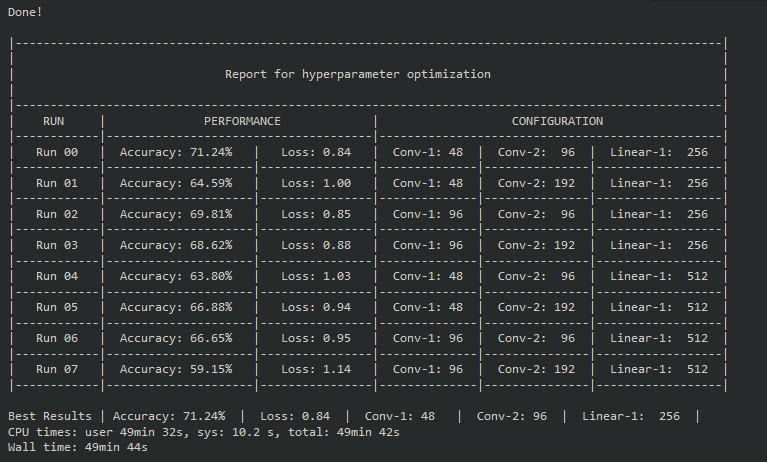

### Results

Looking at the table, the best results came from Run 00 which had `c1=48`, `c2=96`, and `l1=256`. A loss of 0.84 and accuracy of 71.24% is a nice improvement, especially considering it was only 10 epochs!

So, now that we have the hyperparameters with the best performance over 10 epochs, let's fine tune this model! We can train it over many more epochs, and lower the learning rate slightly to try and squeeze out a little more performance. So first, let's define the model we'd like to use, and set the batch size and learning rate:

```py
class ConfigNet(nn.Module):
  def __init__(self, l1=256, c1=48, c2=96, d1=0.1):
    super().__init__()
    self.d1 = d1
    self.conv1 = nn.Conv2d(3, c1, 3)
    self.conv2 = nn.Conv2d(c1, c1, 3)
    self.conv3 = nn.Conv2d(c1, c2, 3)
    self.conv4 = nn.Conv2d(c2, c2, 3, stride=2)
    self.flat = nn.Flatten()
    self.batch_norm = nn.BatchNorm1d(c2 * 144)
    self.fc1 = nn.Linear(c2 * 144, l1)
    self.fc2 = nn.Linear(l1, 10)

  def forward(self, x):
    x = nn.functional.relu(self.conv1(x))
    x = nn.functional.relu(self.conv2(x))
    x = nn.functional.dropout(x, self.d1)
    x = nn.functional.relu(self.conv3(x))
    x = nn.functional.relu(self.conv4(x))
    x = nn.functional.dropout(x, 0.5)
    x = self.flat(x)
    x = nn.functional.relu(self.batch_norm(x))
    x = nn.functional.relu(self.fc1(x))
    x = self.fc2(x)
    return x

model = ConfigNet().to(device)

model = ConfigNet(l1=256, c1=48, c2=96, d1=0.1).to(device)
batch_sz = 512
lrate = 0.0008
```

Finally, we can set `epochs` to 50, and change the path that we want to save the weights to. Let the training cycle run, and early stopping will terminate training if progress halts.

```py
%%time
early_stopping = EarlyStopping(tolerance=6, verbose=True, path="cifar-optimized-test.pth")

loss_fn = nn.CrossEntropyLoss()
optimizer = torch.optim.Adam(model.parameters(), lr=lrate)

train_dataloader = DataLoader(training_data, batch_size=batch_sz, shuffle=True, num_workers=0)
test_dataloader = DataLoader(test_data, batch_size=batch_sz, shuffle=True, num_workers=0)

epochs = 50
for t in range(epochs):
    print(f"Epoch {t+1}\n-------------------------------")
    train_loss = train(train_dataloader, model, loss_fn, optimizer)
    test_loss, test_acc = test(test_dataloader, model, loss_fn)

    # Early Stopping
    early_stopping.step(test_loss)
    if early_stopping.early_stop:
      break
print("Done!")
```

Early stopping should terminate training before hitting 50 epochs, and should achieve an accuracy of about 77%. 

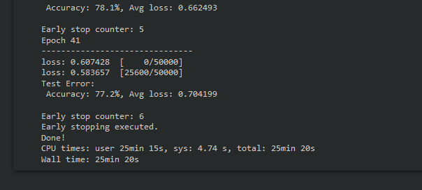

Now that we've tuned hyperparameters, found our best configuration, and fine-tuned that model, it's time to evaluate the model's performance a little more in-depth.

# Model Evaluation

In this case, our test dataset is actually our validation data. We will be reusing our validation data to evaluate the model, but usually you will want to use your real test data for model evaluation after hyperparameter tuning. Let's load in our optimized model, prepare the `test_dataloader` without any image augmentation applied, and run `test()` to evaluate.

```py
model = ConfigNet(l1=256, c1=48, c2=96, d1=0.1).to(device)
model.load_state_dict(torch.load("cifar-optimized-test.pth"))

loss_fn = nn.CrossEntropyLoss()
batch_sz = 512

test_dataloader = DataLoader(test_data, batch_size=batch_sz, shuffle=False, num_workers=0)
classes = test_data.classes
```

```py
test_loss, test_acc = test(test_dataloader, model, loss_fn)
```
This should output the accuracy and loss:

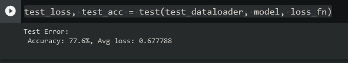

The overall performance is nice, but the performance for each class will be more useful to us. The following code will output our model's accuracy for each class in the dataset:

```py
correct_pred = {classname: 0 for classname in classes}
total_pred = {classname: 0  for classname in classes}

with torch.no_grad():
    for data in test_dataloader:
        images, labels = data
        outputs = model(images.to(device))
        _, predictions = torch.max(outputs, 1)

    for label,prediction in zip(labels, predictions):
        if label == prediction:
            correct_pred[classes[label]] += 1
        total_pred[classes[label]] += 1

for classname, correct_count in correct_pred.items():
    accuracy = 100 * float(correct_count) / total_pred[classname]
    print(f'Accuracy for class {classname:5s}: {accuracy:.1f}%')
```

Executing this block will give us the following output:

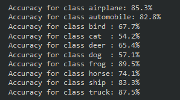

Our model performed quite well on the airplane, automobile, frog, ship, and truck classes. Also interesting to note that the classes it struggled most with are dog and cat, which were also the toughest classes for the fully connected model in the previous part of this series.

### Confusion Matrix

We can gain even more insight on performance with a confusion matrix. Let's set one up, then get a nice visualization.

```py
num_classes = 10

confusion_matrix = torch.zeros(num_classes, num_classes)
with torch.no_grad():
    for i, (inputs, classes) in enumerate(test_dataloader):
        inputs = inputs.to(device)
        classes = classes.to(device)
        outputs = model(inputs)
        _, preds = torch.max(outputs, 1)
        for t, p in zip(classes.view(-1), preds.view(-1)):
                confusion_matrix[t.long(), p.long()] += 1
```

With `confusion_matrix` defined, we can use the Seaborn library to help us visualize it.

```py
plt.figure(figsize=(15,10))
cf_dataframe = pd.DataFrame(np.array(confusion_matrix, dtype='int'), index=test_data.classes, columns=test_data.classes)
heatmap = sns.heatmap(cf_dataframe, annot=True, fmt='g')
```
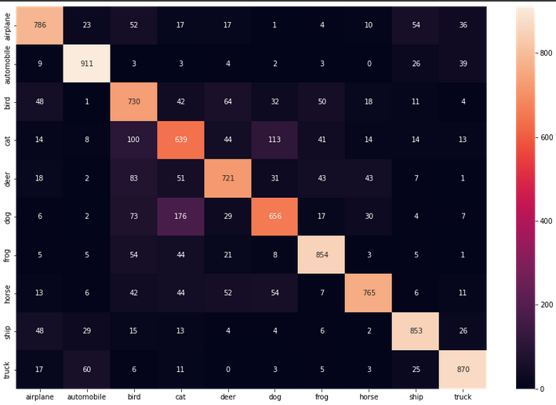

The two dimensions of this table are the "actual" and "predicted" values. We want most of our data to align in that center diagonal, where actual and predicted are the same class. From the incorrect predictions we can see the model often confused `cats` and `dogs`, which were the two classes with the lowest accuracy.

Totals are nice to see, but precision and recall for each class will give us much more meaningful data. Let's have a look at the recall per class first.

### Recall per Class

```py
cf = np.array(confusion_matrix)
norm_cf = cf / cf.astype(float).sum(axis=1)

plt.figure(figsize=(15,10))
cf_dataframe = pd.DataFrame(np.array(norm_cf, dtype='float64'), index=test_data.classes, columns=test_data.classes).astype(float)
heatmap = sns.heatmap(cf_dataframe, annot=True)
```

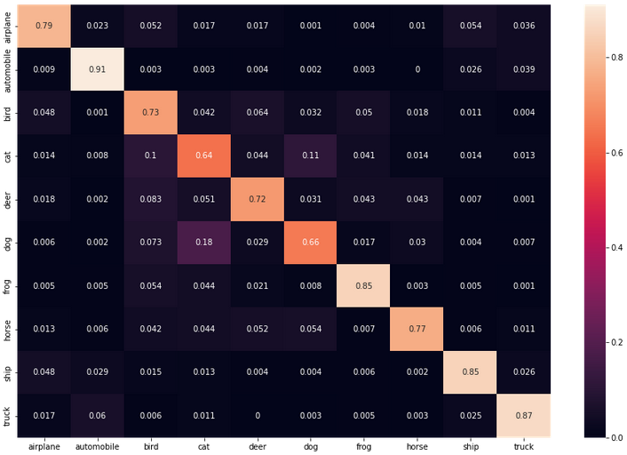

### Precision per Class

```py
cf = np.array(confusion_matrix)
norm_cf = cf / cf.astype(float).sum(axis=0)

plt.figure(figsize=(15,10))
cf_dataframe = pd.DataFrame(np.array(norm_cf, dtype='float64'), index=test_data.classes, columns=test_data.classes).astype(float)
heatmap = sns.heatmap(cf_dataframe, annot=True)
```

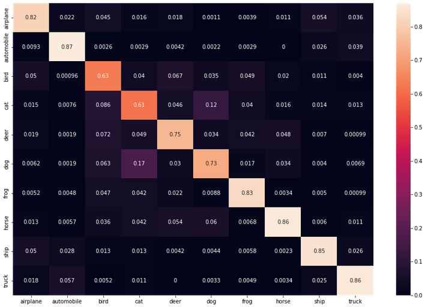

# Sample Model Predictions

Finally, let's feed our model a few images and check out the predictions it makes. Let's make a function to get our image data ready to view:

```py
def imshow(img):
    img = img / 2 + .05 # revert normalization for viewing
    npimg = img.numpy()
    plt.imshow(np.transpose(npimg, (1,2,0)))
    plt.show()
```

Now, we can get our test data prepared, and make another function to get a sample of `n` predictions

```py
test_data = CIFAR10(root = "cifar",
                    train = False,
                    transform = transforms.ToTensor())
classes = test_data.classes
```

```py
def sample_predictions(n = 4):
    test_dataloader = DataLoader(test_data, batch_size=n, shuffle=True, num_workers=0)
    dataiter = iter(test_dataloader)
    images, labels = dataiter.next()

    outputs = model(images.to(device))
    _, predicted = torch.max(outputs, 1)

    imshow(make_grid(images))
    print('[Ground Truth | Predicted]:\n', ' '.join(f'[{classes[labels[j]]:5s} | {classes[predicted[j]]:5s}]\n' for j in range(n)))
```

Call the function, passing the number of images you want to sample. The output will give us the ground truth and predicted class for each image starting from left to right.

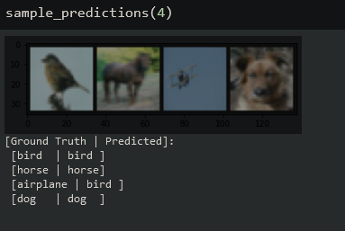

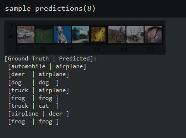


Utilizing a convolutional network with hyperparameter tuning and image augmentation really helped improve the performance on the CIFAR-10 dataset! As always, thanks for reading, and I really hope you've learned a bit about PyTorch and CNN's for image classification. The full Notebook with all of the code presented here is available on [GitHub](https://github.com/florestony54/intro-to-pytorch-2/blob/main/pytorch2_2.ipynb).