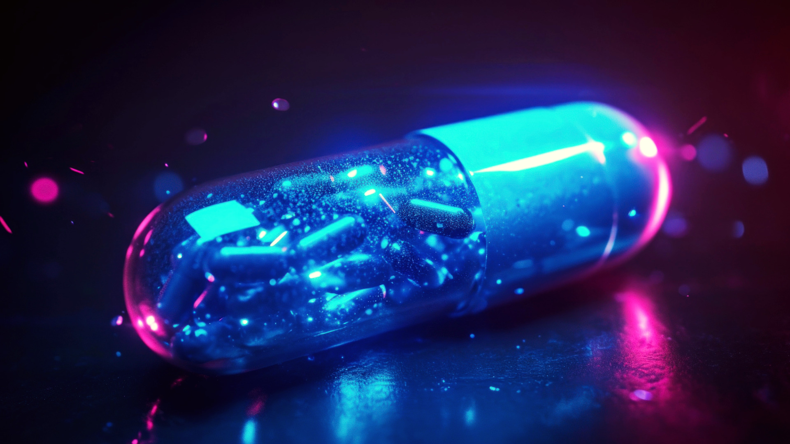
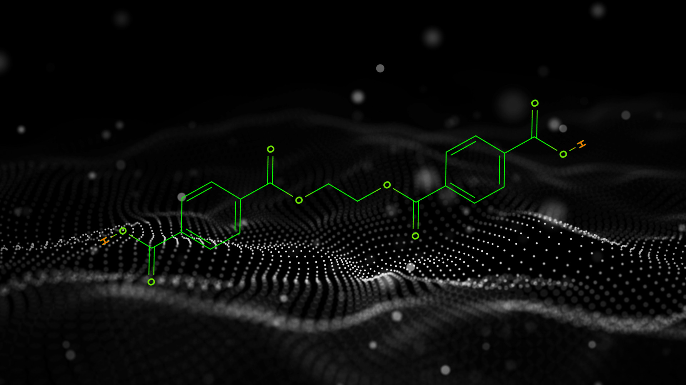
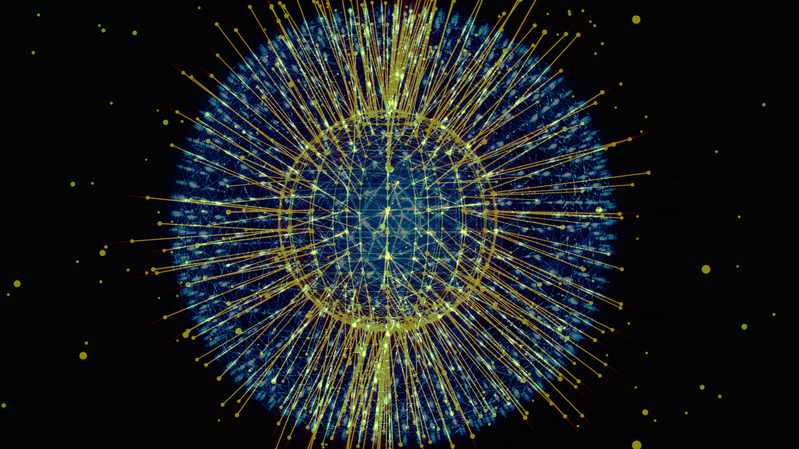
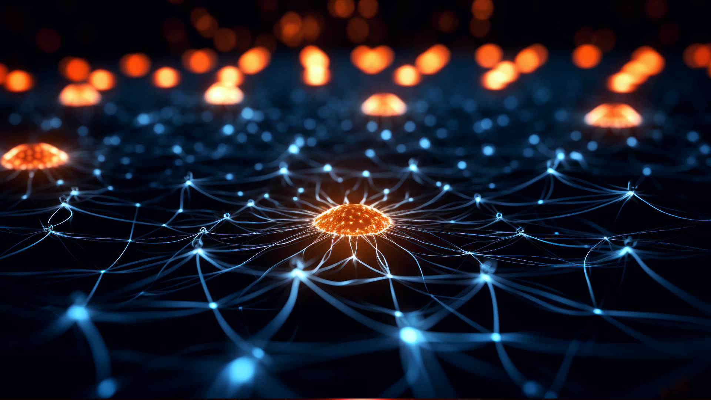

# Machine Learning in Chemistry

Machine learning is becoming a significant tool in the field of chemistry, providing new opportunities in various areas such as drug discovery and materials science. Machine learning algorithms, especially neural networks, are effective at identifying complex patterns in chemical data, which can lead to new insights and speed up processes that were previously dependent on traditional, more time consuming methods. As we examine the impact of machine learning on chemistry, we will look at its uses, and how it not only simplifies regular tasks but also leads to advancements in understanding molecular complexities.

Recently, the combination of machine learning and chemistry has made significant progress. Researchers are using advanced models like CNNs and RNNs for tasks such as creating new drugs, predicting toxicology, and modeling quantitative structure-activity relationships. The pursuit of models that are interpretable and explainable is becoming more important, giving scientists a better understanding of why predictions are made. Additionally, the use of multi-modal data and the development of transfer learning techniques are expanding what can be achieved in predicting material properties and optimizing synthesis planning. These recent trends highlight the growing collaboration between machine learning and chemistry, pushing scientific research into new areas and influencing the future of chemical research.

---

## Chemistry Applications for Machine Learning

A lot of different applications in chemistry research are utilizing machine learning to accelerate processes, discover new chemicals and compounds, and predict behaviors of chemicals in different environments and reactions. Let's take a look at some interesting chemistry domains, and see how machine learning is being leveraged to further research.

#### Drug Discovery and Design

Machine learning can aid in the discovery of new drugs by making predictions at different points in the process. For drugs to take effect on the body, they need to bind to a protein or enzyme in order to trigger the cascade of reactions that lead to the desired effect.  Predicting the drug-protein interaction (DPI) is crucial for drug discovery, since accurate predictions can serve as strong indicators for the biological function that will be affected. The efficacy of a drug, prognostic biomarker identification, clinical trial design, and even FDA approval can also be predicted with machine learning. One of the fields that is really seeing a big focus on drug discovery with machine learning is oncology research, since ML assisted development can rapidly accelerate the discovery of therapeutics to help those that aren't benefiting from existing treatments. 

Here are a few interesting resources related to drug discovery:

* [Machine learning approaches to predict drug efficacy and toxicity in oncology](https://www.ncbi.nlm.nih.gov/pmc/articles/PMC10014302/)
* [Artificial intelligence in drug discovery and development](https://www.ncbi.nlm.nih.gov/pmc/articles/PMC7577280/pdf/main.pdf)
* [MD Anderson and Generate:Biomedicines enter co-development and commercialization agreement to accelerate novel protein therapeutics for oncology using generative AI](https://www.mdanderson.org/newsroom/md-anderson-generate-biomedicines-co-develop-protein-therapies-cancer-using-generative-ai.h00-159617856.html)
* [AI in drug discovery and its clinical relevance](https://www.ncbi.nlm.nih.gov/pmc/articles/PMC10302550/pdf/main.pdf)
* [A deep learning-based method for drug-target interaction prediction based on long short-term memory neural network](https://bmcmedinformdecismak.biomedcentral.com/articles/10.1186/s12911-020-1052-0)

#### Retrosynthesis

In organic chemistry, retrosynthesis is the process of breaking down an organic molecule into its smaller precursor compounds (usually a compound that is simple or commercially available), then working backward from those precursors to synthesize the original target molecule. The goal is not only to find a viable synthetic pathway, but also to find an efficient one, since more than one synthetic route will be possible. [4] Machine learning can augment this research process by predicting reaction pathways[19] [21], recommending reaction conditions[20], and predicting likelihood of success for a particular reaction. 

* [Microsoft Research Blog: Incorporating chemists’ insight with AI models for single-step retrosynthesis prediction](https://www.microsoft.com/en-us/research/blog/incorporating-chemists-insight-with-ai-models-for-single-step-retrosynthesis-prediction/)
* [Deep learning in retrosynthesis planning: datasets, models and tools](https://academic.oup.com/bib/article/23/1/bbab391/6375056)
* [Recent advances in artificial intelligence for retrosynthesis](https://arxiv.org/abs/2301.05864)

#### Atomic Simulations

In computational chemistry, systems of atoms or molecules can be simulated to study the behavior of these molecules under certain conditions, which is very useful for predicting material properties. One category of atomic simulations is molecular dynamics, where the physical motion of molecules are modeled using Newtonian mechanics and force fields. Another type of atomic simulation is one that uses the electronic structure and behavior of atoms using quantum mechanics. 

In many cases (especially with quantum chemistry simulations), calculations used for simulating molecular systems are very expensive to compute, sometimes taking weeks to complete. This high computational cost will limit the size of the system being modeled (number of molecules), or the duration of the simulation. Researchers are using machine learning to increase the calculation speed, allowing for larger system simulations.[23] In the context of systems with quantum mechanics calculations, machine learning can be used to predict potential energy surfaces rather than having to solve the Schrödinger equation, allowing faster calculations for large systems. [24]

* [44 Million Atoms Simulated Using AI](https://youtube.com/shorts/AMhdgg26Bg0?si=FfRTr20ZnLQRY2Vb)
* [Machine-learning atomic simulation for heterogeneous catalysis](https://www.nature.com/articles/s41524-022-00959-5)
* [What are Atomistic Simulations?](https://www.synopsys.com/glossary/what-are-atomistic-simulations.html)

#### Catalysis

Catalysis is the process where a substance, known as a catalyst, increases the rate of a chemical reaction without being consumed or chemically changed at the end of the reaction. There are several different classifications of catalysis, each with unique characteristics and applications:

* Homogeneous Catalysis: catalyst and the reactants are in the same phase of matter, usually gas or liquid

* Heterogeneous Catalysis: the catalyst is in a different phase from the reactants. Typical examples involve a solid catalyst with the reactants as either liquids or gases [27]

* Autocatalysis: this is a type of catalysis where one of the products of the reaction acts as a catalyst for the reaction [29]

* Enzyme Catalysis: this involves enzymes, which are biological catalysts, that speed up biochemical reactions [28]

* Photocatalysis: light is used to speed up a reaction [30]

* Environmental Catalysis and Green Catalytic Processes: these are types of catalysis aimed at reducing environmental impact and promoting sustainability [26]

Machine learning provides a promising avenue for advancing catalysis research by enabling  reaction mechanism prediction[25], network exploration, synthetic condition optimization, and catalyst design, while also fostering interpretability and integration with experimental data.

* [Nature - Machine learning in catalysis](https://www.nature.com/collections/gfbfaeaibd)
* [Accelerating Biocatalysis Discovery with Machine Learning](https://pubs.acs.org/doi/pdf/10.1021/acscatal.3c03417)
* [Rates Against the Machine](https://www.nature.com/articles/s41929-023-00933-4)

#### Other Applications

Obviously chemistry is a huge field, but the broad applicability of ML is making it so it finds its way into all branches of chemistry research. A few other interesting applications include:

* Predictive toxicology - large datasets from sources like high-throughput assays[31] and omics[32] approaches to predict the toxicity of chemicals

* Spectroscopy and analytical chemistry - machine learning can be used to automate the identification of compounds in complex spectral data[33] [34]

*  Materials Science - ML techniques have been used to accelerate and improve the accuracy of predictions of phase diagrams, crystal structures, and other material properties [35] 
    * [An article I wrote on ML in Materials Science](https://towardsdatascience.com/machine-learning-in-materials-science-8c6c0db5ce7a)

---

## ML Algorithms and Use-Cases in Chemistry

Now that we've looked through the "chemistry lens" and seen how research in the field can be advanced by leveraging machine learning, let's shift perspective, and look through the "machine learning lens" by focusing on how different ML algorithms are being used in chemistry research.  

#### Decision Trees

Decision Trees are popular with researchers in the natural sciences like chemistry due to the interpretability of the model predictions, allowing for transferability to other problems in the field. On top of that, decision trees work well with smaller datasets. This often makes this algorithm a natural fit, since a common obstacle for machine learning in chemistry research is the lack of availability of high-quality data.[2] Finally, fewer hyperparameters to tune and lower computational costs never hurt. A few drawbacks with decision trees are that they don't always play nice with noisy data or large datasets, and the limitation of decision nodes to binary outcomes can leave some wanting a little more flexibility. 
  * [https://scikit-learn.org/stable/modules/tree.html]()
  * [https://www.coursera.org/articles/decision-tree-machine-learning]()
  * [https://www.ibm.com/topics/decision-trees]()

#### Convolutional Neural Networks

Convolutional neural networks are best suited for working with visual data and tasks like image classification, recognition, and segmentation. The real power of CNNs is their effectiveness in tasks where spatial arrangement of features and local patterns are important for accurate analysis. In chemistry, these strengths can be utilized for tasks like gas leak detection, prediction of molecular properties[7] with SMILES,[8] prediction of materials properties, and protein structure prediction as with AlphaFold1. [10]

  * [An Intro to PyTorch I wrote with a short section on CNNs](https://medium.com/towards-data-science/intro-to-pytorch-2-convolutional-neural-networks-487d8a35139a)
  * [https://cs231n.github.io/convolutional-networks/]()
  * [MIT Open Library CNN notes](https://openlearninglibrary.mit.edu/courses/course-v1:MITx+6.036+1T2019/courseware/Week8/convolutional_neural_networks/?activate_block_id=block-v1%3AMITx%2B6.036%2B1T2019%2Btype%40sequential%2Bblock%40convolutional_neural_networks)
  * [MIT Introduction to Deep Learning 2022 lecture on CNNs](https://openlearninglibrary.mit.edu/courses/course-v1:MITx+6.036+1T2019/courseware/Week8/convolutional_neural_networks/?activate_block_id=block-v1%3AMITx%2B6.036%2B1T2019%2Btype%40sequential%2Bblock%40convolutional_neural_networks)

#### Recurrent Neural Networks

Recurrent Neural Networks (RNNs) are designed for processing sequential data, making them well-suited for tasks where temporal dependencies and the order of input elements matter. RNNs excel in natural language processing, time series analysis, and speech recognition, as they can capture and leverage information from previous steps in the sequence. 

One of the cool ways RNNs are used in chemistry research are generating de novo molecular designs with SMILES string representations of chemical structures.[11] SMILES characters are the tokens for the model, and the sequence is generated one token at a time, given the previous section of the string. RNNs have also been used in Quantitative Structure-Activity Relationship (QSAR)[13] modeling in organic material discovery[9], where the activity of a molecule is predicted using chemical/physical properties and molecular descriptors as the features. Another interesting use of RNN's is the discovery of novel chemical reactions with generative RNNs, specifically a sequence-to-sequence autoencoder with bidirectional LSTM layers.[12] 

* [Stanford RNN Cheat Sheet](https://stanford.edu/~shervine/teaching/cs-230/cheatsheet-recurrent-neural-networks)
* [AWS: What is an RNN?](https://aws.amazon.com/what-is/recurrent-neural-network/)
* [PyTorch RNN Docs](https://pytorch.org/docs/stable/generated/torch.nn.RNN.html)

#### Graph Neural Networks

Graph Neural Networks are based on the mathematical structure of graphs, consisting of nodes and edges that represent a relationship between two nodes. GNNs are trained on *data that is represented as graphs*, and typically (although not always) work via message passing between nodes. [14] Typical applications for graphs and GNNs include social networks, recommendation systems, and network traffic. In chemistry, GNNs are excellent for modeling molecules since they can naturally be represented by graphs. GNNs have been used to predict molecular and crystal properties, as well as modeling potential-energy surfaces for discovery of new materials with desired properties. [15]

* [NVIDIA: What are Graph Neural Networks?](https://blogs.nvidia.com/blog/what-are-graph-neural-networks/)
* [PyTorch Geometric](https://pytorch-geometric.readthedocs.io/en/latest/)
* [PyTorch Lightning GNN Tutorial](https://lightning.ai/docs/pytorch/stable/notebooks/course_UvA-DL/06-graph-neural-networks.html)

#### Transformers

Transformers are neural networks that learn context via a mathematical technique called **attention** to learn relationships in sequential data such as text. Transformers are considered *foundation models*, meaning they can be trained on broad data, and later fine-tuned to more specific downstream tasks. [16] Popular transformer models include GPT, BERT, and T5. AlphaFold2, developed by Google DeepMind is probably the most notable application of transformer models in the chemistry space, predicting the 3-dimensional conformation of proteins, which previously had proven to be a very difficult challenge for researchers. [17] Like many other types of models, transformers are also used in drug discovery, retrosynthetic planning, and exploration of chemical space. [18]

* [NVIDIA: What is a Transformer Model?](https://blogs.nvidia.com/blog/what-is-a-transformer-model/)
* [PyTorch Transformer Documentation](https://pytorch.org/docs/stable/generated/torch.nn.Transformer.html)
* [Attention is All You Need](https://arxiv.org/abs/1706.03762)

---

## Important Considerations and Challenges in the Field

Although applying machine learning to chemistry research holds a ton of promise, there are still some hurdles to overcome in the field.  High quality, and sufficiently large datasets are lacking in the chemistry field, and it's quite common for data to be scattered across multiple databases, stemming from multiple sources. Stitching data together from multiple sources also brings the issue of lack of standardization for data formats, representation, and evaluation metrics. 

Additionally, with expertise in the domain of chemistry, researchers may sometimes be unfamiliar with state-of-the-art machine learning methods, computer science techniques, and best practices. This can make it difficult to effectively identify and engineer important features that can best represent complex chemical systems that may not be straightforward for traditional ML algorithms. Finally, since chemical systems can be so complex and tricky to represent, different types of neural network models are commonly used since they can capture complex data relationships. This, however, comes with the caveat that they lack interpretability that something like a decision tree would provide. Furthermore, chemistry datasets typically exhibit a bias towards successful experiments[36]. Including data from failed experiments as well as successful ones will allow for a more comprehensive understanding and analysis of the chemical space.

The good news is that recent breakthroughs in LLMs are sparking a ton of interest in machine learning, and this is attracting interest from people with all sorts of backgrounds.  Hopefully with this surge of interest, many will feel encouraged to develop their programming, data, and machine learning skills.  The development of new ML algorithms, data collection strategies, and collaboration between chemists and data scientists will be key to overcoming these challenges and realizing the full potential of ML in chemistry.

I hope you enjoyed reading! If you enjoyed or found this content helpful, consider subscribing or following to receive updates on future posts. Feel free to make suggestions for content you'd like to read in the future in the comments or by email! Thanks for reading! 

---

## References
[1] Duan, Chenru, Du, Yuanqi, Jia, Haojun and Kulik, Heather J. 2023. *Accurate transition state generation with an object-aware equivariant elementary reaction diffusion model.* Nature Computational Science. https://dspace.mit.edu/handle/1721.1/153174

[2] Yun-Fei Shi, Zheng-Xin Yang, Sicong Ma, Pei-Lin Kang, Cheng Shang, P. Hu, Zhi-Pan Liu.
*Machine Learning for Chemistry: Basics and Applications*,
Engineering, 2023, ISSN 2095-8099, https://doi.org/10.1016/j.eng.2023.04.013.

[3] Shi, Zoe. *An Introduction to the Chemical Reaction Network Theory*.  https://sites.math.washington.edu/~morrow/336_20/papers20/zoey.pdf

[4] https://en.wikipedia.org/wiki/Retrosynthetic_analysis

[5] Victor Garcia Satorras, Emiel Hoogeboom, Max Welling.*E(n) Equivariant Graph Neural Networks*. https://arxiv.org/pdf/2102.09844.pdf

[6] [OA-ReactDiff Github Repo](https://github.com/chenruduan/OAReactDiff/blob/398ebe052b60e337a04b0a9832549fe5de31c21a/OA-ReactDiff.ipynb)

[7] Ståhl N, Falkman G, Karlsson A, Mathiason G, Boström J. *Deep Convolutional Neural Networks for the Prediction of Molecular Properties: Challenges and Opportunities Connected to the Data*. J Integr Bioinform. 2018 Dec 5;16(1):20180065. doi: 10.1515/jib-2018-0065. PMID: 30517077; PMCID: PMC6798861.

[8] J. Chem. Inf. Comput. Sci. 1988, 28, 1, 31–36 Publication Date:February 1, 1988. https://doi.org/10.1021/ci00057a005

[9] Li Y, Xu Y, Yu Y. *CRNNTL: Convolutional Recurrent Neural Network and Transfer Learning for QSAR Modeling in Organic Drug and Material Discovery*. Molecules. 2021; 26(23):7257. https://doi.org/10.3390/molecules26237257 

[10] Senior, A.W., Evans, R., Jumper, J. et al. *Improved protein structure prediction using potentials from deep learning*. Nature 577, 706–710 (2020). https://doi.org/10.1038/s41586-019-1923-7

[11] J. Chem. Inf. Model.2020, 60, 1175−1183. https://pubs.acs.org/doi/10.1021/acs.jcim.9b00943

[12] Bort W, Baskin II, Gimadiev T, Mukanov A, Nugmanov R, Sidorov P, et al. Discovery of novel chemical reactions by deep generative recurrent neural network. Sci Rep 2021;11(1)

[13] https://en.wikipedia.org/wiki/Quantitative_structure%E2%80%93activity_relationship

[14] https://arxiv.org/ftp/arxiv/papers/1812/1812.08434.pdf

[15] https://arxiv.org/pdf/1712.06113.pdf

[16] https://arxiv.org/pdf/2108.07258.pdf

[17] Jumper, J., Evans, R., Pritzel, A. et al. Highly accurate protein structure prediction with AlphaFold. Nature 596, 583–589 (2021). https://doi.org/10.1038/s41586-021-03819-2

[18] https://arxiv.org/pdf/2310.06083.pdf

[19] Ucak, U.V., Ashyrmamatov, I., Ko, J. et al. Retrosynthetic reaction pathway prediction through neural machine translation of atomic environments. Nat Commun 13, 1186 (2022). https://doi.org/10.1038/s41467-022-28857-w

[20] ACS Cent. Sci. 2018, 4, 11, 1465–1476 Publication Date:November 16, 2018. https://doi.org/10.1021/acscentsci.8b00357

[21] S. Zheng, J. Rao, Z. Zhang, J. Xu, Y. Yang, Predicting retrosynthetic reactions using self-corrected transformer neural networks, J. Chem. Inf. Model. 60 (2020) 47–55, https://doi.org/10.1021/acs.jcim.9b00949

[22] https://doi.org/10.1016/j.aichem.2024.100049

[23] https://www.youtube.com/watch?v=ibELoCSf3cE&t=142s

[24] https://pubs.acs.org/doi/10.1021/acs.accounts.0c00472

[25] https://www.nature.com/articles/d41586-023-00145-7

[26] https://pubs.acs.org/doi/pdf/10.1021/acs.est.3c00293

[27] https://deepblue.lib.umich.edu/bitstream/handle/2027.42/144583/aic16198_am.pdf?sequence=2

[28] https://pubs.acs.org/doi/epdf/10.1021/acscatal.9b04321

[29] https://link.springer.com/article/10.1557/s43579-021-00061-9

[30] https://www.sciencedirect.com/science/article/abs/pii/S0304389422018258

[31] https://en.wikipedia.org/wiki/High-throughput_screening

[32] https://en.wikipedia.org/wiki/Omics

[33] https://pubs.rsc.org/en/content/articlehtml/2022/dd/d1dd00027f

[34] https://link.springer.com/chapter/10.1007/978-3-030-87013-3_5

[35] https://tsapps.nist.gov/publication/get_pdf.cfm?pub_id=915933

[36] https://phys.org/news/2023-09-machine-chemistry-basics-applications.pdf