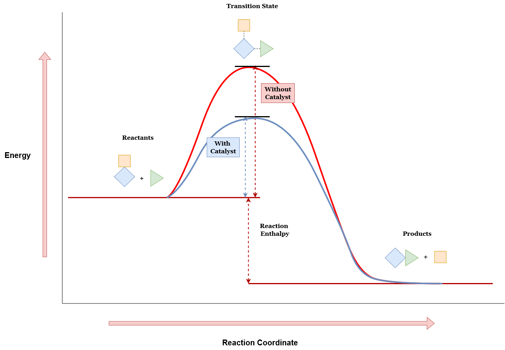

# Machine Learning in Chemistry

In the dynamic landscape of scientific discovery, machine learning has emerged as a transformative force, reshaping the contours of chemistry research. This marriage of computational prowess and chemical expertise has unlocked unprecedented opportunities across diverse domains, ranging from drug discovery to materials science. Machine learning algorithms, particularly neural networks, have become adept at deciphering complex patterns within chemical data, offering novel insights and accelerating processes that once relied solely on traditional methodologies. As we embark on this exploration of machine learning's impact on chemistry, we will delve into its applications, uncovering how it not only streamlines routine tasks but also catalyzes breakthroughs in understanding molecular intricacies.

In recent trends, the intersection of machine learning and chemistry has witnessed remarkable strides. Researchers are increasingly leveraging advanced models like convolutional and recurrent neural networks for tasks such as de novo drug design, predictive toxicology, and quantitative structure-activity relationship (QSAR) modeling. The quest for interpretable and explainable models is also gaining prominence, offering scientists insights into the rationale behind predictions. Moreover, the integration of multi-modal data and the development of transfer learning techniques are pushing the boundaries of what is achievable in predicting material properties and optimizing synthesis planning. These recent trends underscore the evolving synergy between machine learning and chemistry, propelling scientific inquiry into new frontiers and shaping the future of chemical research.

  * Drug Discovery and Design:
      * Researchers continue to use machine learning for drug discovery, predicting molecular properties, and optimizing lead compounds.
      Generative models like variational autoencoders (VAEs) and deep reinforcement learning are being explored for de novo drug design.

  * Quantitative Structure-Activity Relationship (QSAR):
      * Advances in deep learning and graph neural networks are contributing to more accurate QSAR models.
      Integration of multi-modal data (e.g., chemical structure, omics data) is an area of interest.

  * Materials Science:
      * Machine learning is applied to predict material properties, accelerate materials discovery, and optimize material compositions.
      Emphasis on interpretable models for understanding the relationships between material structures and properties.

  * Chemoinformatics and Molecular Representation:
      * Continued research on improving molecular representation using graph neural networks and attention mechanisms.
      Integration of transfer learning approaches for leveraging pre-trained models.

  * Predictive Toxicology:
      * Machine learning models are developed to predict the toxicity of chemical compounds.
      Integration of explainability techniques to understand the features contributing to toxicity predictions.

  * Spectroscopy and Analytical Chemistry:
      * Use of machine learning for spectral analysis, peak identification, and quantitative analysis in various analytical techniques.
      Hybrid models combining deep learning and traditional chemometric methods.

  * Reaction Prediction and Synthesis Planning:
      * Research on predicting chemical reactions and retrosynthetic pathways using deep learning models.
      Integration of reinforcement learning for optimizing synthesis planning.

  * Text Mining and Literature Analysis:
      * Natural language processing (NLP) and machine learning are applied to extract chemical information from scientific literature.
      Development of tools for automated curation and analysis of chemical data from textual sources.

  * Biology and Systems Biology:
      * Application of machine learning to analyze biological data, predict protein structures, and understand molecular interactions.
      Integration of machine learning with systems biology for a holistic understanding of biological processes.

  * Explainability and Interpretability:
      * Increased focus on making machine learning models in chemistry more interpretable and explainable.
      Development of tools and methods to interpret the decisions of complex models.

---

## 3 Important Chemistry Sub-Fields for Machine Learning

Lorem ipsum dolor sit amet, consectetur adipiscing elit, sed do eiusmod tempor incididunt ut labore et dolore magna aliqua. Ut enim ad minim veniam, quis nostrud exercitation ullamco laboris nisi ut aliquip ex ea commodo consequat. Duis aute irure dolor in reprehenderit in voluptate velit esse cillum dolore eu fugiat nulla pariatur. Excepteur sint occaecat cupidatat non proident, sunt in culpa qui officia deserunt mollit anim id est laborum.

#### Retrosynthesis

* models predict likely routes for organic synthesis
* Retrosynthetic analysis in a nutshell:
  * "The goal of retrosynthetic analysis is a structural simplification. Often, a synthesis will have more than one possible synthetic route. Retrosynthesis is well suited for discovering different synthetic routes and comparing them in a logical and straightforward fashion" [4]

#### Atomic Simulations

* potential to accelerate potential energy surface sampling

#### Heterogeneous Catalysis

* catalytic design, synthetic condition optimization, reaction mechanism exploration

---

## ML Algorithms and Use-Cases in Chemistry

Now that we've looked through the "chemistry lens" and seen how research in the field can be advanced by leveraging machine learning, let's shift perspective, and look through the "machine learning lens".  

#### Decision Trees
Decision Trees are popular with researchers in the natural sciences like chemistry due to the interpretability of the model predictions, allowing for transferability to other chemistry problems. On top of that, decision trees work well with smaller datasets. This often makes this algorithm a natural fit, since a common obstacle for machine learning in chemistry research is the lack of availability of high-quality data.[2] Finally, fewer hyperparameters to tune and lower computational costs never hurt. A few drawbacks with decision trees are that they dont always play nice with noisy data or large datasets, and the limitation of decision nodes to binary outcomes can leave some wanting a little more flexibility. 
  * [https://scikit-learn.org/stable/modules/tree.html]()
  * [https://www.coursera.org/articles/decision-tree-machine-learning]()
  * [https://www.ibm.com/topics/decision-trees]()

#### Convolutional Neural Networks
Convolutional neural networks are best suited for working with visual data and tasks like image classification, recognition, and segmentation. The real power of CNNs is their effectiveness in tasks where spatial arrangement of features and local patterns are important for accurate analysis. In chemistry, these strengths can be utilized for tasks like gas leak detection, prediction of molecular porperties[7] with SMILES,[8] prediction of materials properties, and protein structure prediction as with AlphaFold. [10]

  * [An Intro to PyTorch I wrote with a short section on CNNs](https://medium.com/towards-data-science/intro-to-pytorch-2-convolutional-neural-networks-487d8a35139a)
  * [https://cs231n.github.io/convolutional-networks/]()
  * [MIT Open Library CNN notes](https://openlearninglibrary.mit.edu/courses/course-v1:MITx+6.036+1T2019/courseware/Week8/convolutional_neural_networks/?activate_block_id=block-v1%3AMITx%2B6.036%2B1T2019%2Btype%40sequential%2Bblock%40convolutional_neural_networks)
  * [MIT Introduction to Deep Learning 2022 lecture on CNNs](https://openlearninglibrary.mit.edu/courses/course-v1:MITx+6.036+1T2019/courseware/Week8/convolutional_neural_networks/?activate_block_id=block-v1%3AMITx%2B6.036%2B1T2019%2Btype%40sequential%2Bblock%40convolutional_neural_networks)

#### Recurrent Neural Networks
Recurrent Neural Networks (RNNs) are designed for processing sequential data, making them well-suited for tasks where temporal dependencies and the order of input elements matter. RNNs excel in natural language processing, time series analysis, and speech recognition, as they can capture and leverage information from previous steps in the sequence. 

One of the cool ways RNNs are used in chemistry research are generating de novo molecular designs with SMILES[8] string representations of chemical structures.[11] SMILES characters are the tokens for the model, and the sequence is generated one token at a time, given the previous section of the string. RNNs have also been used in Quantitative Structure-Activity Relationship (QSAR)[13] modeling in organic material discovery[9], where the activity of a molecule is predicted using chemical/physical properties and molecular descriptors as the features. Another interesting use of RNN's is the discovery of novel chemical reactions with generative RNNs, specifically a sequence-to-sequence autoencoder with bidirectional LSTM layers.[12] 

#### Graph Neural Networks

#### Transformers

---

## Important Considerations and Challenges in the Field

* common problem with chemistry datasets is the heavy bias towards successful experiments

---

## Paper Review: Accurate transition state generation with an object-aware equivariant elementary reaction diffusion model

#### What's a transition state?

#### Chemical Reaction Network Theory

https://sites.math.washington.edu/~morrow/336_20/papers20/zoey.pdf

#### Equivariant Graph Neural Networks

https://arxiv.org/pdf/2102.09844.pdf

## References
[1] Duan, Chenru, Du, Yuanqi, Jia, Haojun and Kulik, Heather J. 2023. *Accurate transition state generation with an object-aware equivariant elementary reaction diffusion model.* Nature Computational Science. https://dspace.mit.edu/handle/1721.1/153174

[2] Yun-Fei Shi, Zheng-Xin Yang, Sicong Ma, Pei-Lin Kang, Cheng Shang, P. Hu, Zhi-Pan Liu.
*Machine Learning for Chemistry: Basics and Applications*,
Engineering, 2023, ISSN 2095-8099, https://doi.org/10.1016/j.eng.2023.04.013.

[3] Shi, Zoe. *An Introduction to the Chemical Reaction Network Theory*.  https://sites.math.washington.edu/~morrow/336_20/papers20/zoey.pdf

[4] https://en.wikipedia.org/wiki/Retrosynthetic_analysis

[5] Victor Garcia Satorras, Emiel Hoogeboom, Max Welling.*E(n) Equivariant Graph Neural Networks*. https://arxiv.org/pdf/2102.09844.pdf

[6] [OA-ReactDiff Github Repo](https://github.com/chenruduan/OAReactDiff/blob/398ebe052b60e337a04b0a9832549fe5de31c21a/OA-ReactDiff.ipynb)

[7] Ståhl N, Falkman G, Karlsson A, Mathiason G, Boström J. *Deep Convolutional Neural Networks for the Prediction of Molecular Properties: Challenges and Opportunities Connected to the Data*. J Integr Bioinform. 2018 Dec 5;16(1):20180065. doi: 10.1515/jib-2018-0065. PMID: 30517077; PMCID: PMC6798861.

[8] J. Chem. Inf. Comput. Sci. 1988, 28, 1, 31–36 Publication Date:February 1, 1988. https://doi.org/10.1021/ci00057a005

[9] Li Y, Xu Y, Yu Y. *CRNNTL: Convolutional Recurrent Neural Network and Transfer Learning for QSAR Modeling in Organic Drug and Material Discovery*. Molecules. 2021; 26(23):7257. https://doi.org/10.3390/molecules26237257 

[10] Senior, A.W., Evans, R., Jumper, J. et al. *Improved protein structure prediction using potentials from deep learning*. Nature 577, 706–710 (2020). https://doi.org/10.1038/s41586-019-1923-7

[11] J. Chem. Inf. Model.2020, 60, 1175−1183. https://pubs.acs.org/doi/10.1021/acs.jcim.9b00943

[12] Bort W, Baskin II, Gimadiev T, Mukanov A, Nugmanov R, Sidorov P, et al. Discovery of novel chemical reactions by deep generative recurrent neural network. Sci Rep 2021;11(1)

[13] https://en.wikipedia.org/wiki/Quantitative_structure%E2%80%93activity_relationship